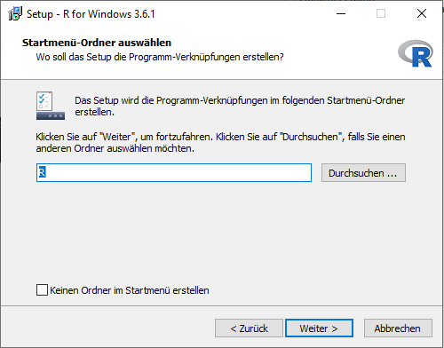

# Installation und Aktualisierung von R und RStudio

<p style="font-weight:600; font-size:36px">Einleitung</p>

<span class ="r highlight">R</span> ist eine Statistiksoftware, die mittlerweile weit verbreitet ist - sowohl in der Forschung als auch in der Wirtschaft. <span class ="r">R</span> ist **kostenlos**, für alle gängigen Betriebssysteme verfügbar <font size="2">(Windows, Max OS X und  Linux)</font> und darüber hinaus auch noch **open-source**. Das heißt, um <span class ="r">R</span> zu nutzen, muss man keine teure Lizenz kaufen und jede/r kann sich an der (Weiter-)Entwicklung des Programms oder einzelner Pakete beteiligen. Durch die weite Verbreitung von <span class ="r">R</span> finden sich außerdem ausführliche Anleitungen im Internet, sollten wir mal nicht mehr weiter wissen.

<span class ="r">R</span> selbst ist relativ spartanisch und die meisten AnwenderInnen nutzen daher die <span class="highlight">Entwicklungsumgebung <span class ="r">RStudio</span></span>, welche auch eine umfassendere Benutzeroberfläche besitzt. Mit dieser können wir z.B. **Skripte** nutzen, in denen wir unsere Analysen speichern können. Außerdem gibt es ein **Environment**, das uns anzeigt, welche Objekte in <span class ="r">R</span> vorhanden sind (d.h. die wir eingelesen oder direkt in <span class ="r">R</span> erstellt haben). Hier finden wir zusätzlich einen Reiter **Help**, welcher uns Informationen und Anwendungshinweise zu Funktionen gibt.

<aside>\
Der Aufbau der Entwicklungsumgebung <span class="r">RStudio</span> wird im Kapitel [Einführung in R] [Einführung in R] erklärt.</aside>

Im vorliegenden Kapitel schauen wir uns jeweils für <span class="highlight">Windows</span> und <span class="highlight">Mac</span> an, wie wir <span class ="r">R</span> und <span class ="r">RStudio</span> installieren oder auf eine neuere Version aktualisieren und dabei **unsere bisher heruntergeladenen Pakete behalten** können.

<details><summary class="mtitle">*Was ist mit Linux?*</summary><div class="more">
Bevor wir die <span class ="r">R</span>-Lernplattform ins Leben gerufen haben, haben wir eine Umfrage durchgeführt, in der u.a. das Betriebssystem der NutzerInnen erfragt wurde. Hierbei hat nur ein Bruchteil der Personen angegeben, mit Linux bzw. Ubuntu zu arbeiten. Aufgrund der geringen Nachfrage gibt es kein gesondertes Kapitel für Linux-UserInnen. Im Folgenden sind einige Links zur Hilfe aufgeführt.

Für die Installation von <span class ="r">R</span> und <span class ="r">RStudio</span> unter <span class="highlight">Ubuntu</span> empfiehlt sich die Installationsanleitung auf <a href="https://linuxhint.com/rstudio-for-ubuntu/" target="_blank">linuxhunt.com</a> zu nutzen <font size="1">(englisch)</font>. Anstatt `wget https://download1.rstudio.org/rstudio-0.99.896-amd64.deb` ändern wir den Link zur gewünschten <span class ="r">RStudio</span> Version für unser Betriebssystem, z.B. `wget [https://download1.rstudio.org/desktop/bionic/amd64/rstudio-1.3.1073-amd64.deb](https://download1.rstudio.org/electron/jammy/amd64/rstudio-2022.12.0-353-amd64.deb)`. Den benötigten aktuellen Link bekommen wir von der <a href="https://rstudio.com/products/rstudio/download/#download" target="_blank"><span class ="r">RStudio</span> Seite</a> mittels Rechtsklick auf den Link und Auswahl im erscheinenden Menü.

Falls ihr das Problem habt, dass mit der obigen Anleitung nicht die aktuelle <span class ="r">R</span> Version 4.0 installiert wird, oder falls ihr zu <span class ="r">R</span> 4.0 upgraden wollt, schaut auch <a href="https://medium.com/@hpgomide/how-to-update-your-r-3-x-to-the-r-4-x-in-your-linux-ubuntu-46e2209409c3" target="_blank">diese Anleitung</a> an. 

Falls ihr nur Probleme mit dem Updaten auf die neuste Version habt, führt aus dem Abschnitt *How can I update my R 3.x to the new shiny R4.x?* den Code **ab** `sudo apt-key ...` im Terminal aus. 
</div></details>\

> *__Achtung__*:  Die <span class ="r">R</span>- und <span class ="r">RStudio</span>-Versionen auf den Screenshots könnten bereits veraltet sein, wenn ihr die Anleitung nutzt. Die angegebenen Links führen euch aber dennoch zu den aktuellsten Versionen.

> *__Achtung__*:  <font color="#930047">**Zur Übernahme der Pakete bei Upgrade auf <span class ="r">R</span> 4.0+**</font>\
Wir können das Paket installr <font size="2">(Windows)</font> bzw. das manuelle Verschieben der Pakete <font size="2">(Mac)</font> hier nicht nutzen, um unsere alten Pakete zu erhalten. Wir müssen **alle Pakete neu installieren**. Falls wir sehr viele Pakete haben, hilft uns folgende <a href="https://www.r-bloggers.com/get-all-your-packages-back-on-r-4-0-0/" target="_blank">Anleitung von r-bloggers</a>. 


## **Windows**

<font size="2">Die folgenden Installationen wurden unter Nutzung von **Firefox 70.0.1** durchgeführt.</font>

### Installation von <span class ="r">**R**</span>

Auf dieser <a href="https://cran.r-project.org" target="_blank">Seite</a> klicken wir auf *Download <span class ="r">R</span> for Windows* und auf der folgenden Seite auf *Install <span class ="r">R</span> for the first time*. Dann kommen wir auf eine Seite, auf der wir die aktuellste <span class ="r">R</span>-Version finden. 

```{r, out.width = "700px", echo=FALSE}
knitr::include_graphics("figures/Installation/Bilder/Win_R_aktuell.png")
```

Diese Version läuft unter **Windows XP**, **Windows Vista**, **Windows 8** und **Windows 10**. Sollten wir eine dieser Windows Versionen auf unserem Computer haben, drücken wir auf **Download <span class ="r">R</span> 3.6.1 for Windows**.

<details><summary class="mtitle">*<a name="winv"></a>Wie finde ich meine Windows Version heraus?*</summary><div class="more">
Um die aktuelle Version unseres Windows Systems herauszufinden, drücken wir die **Windows-Taste** und die **Pause Taste** gleichzeitig. 

> *__Achtung__*:  <div class="rows">Bei manchen Rechner muss man zur Aktivierung der Pause-Taste zusätzlich noch die **fn-Taste** drücken.</div>

```{r, out.width = "600px", echo=FALSE}
knitr::include_graphics("figures/Installation/Bilder/keybord.png")
```

Es öffnet sich ein Fenster mit den grundlegenden Informationen über unseren Computer.

```{r, out.width = "600px", echo=FALSE}

```

Ganz oben sehen wir dort unter **Windows Edition**, welche Windows Version wir installiert haben. Wichtig ist auch der Eintrag unter **Systemtyp**. Hier steht entweder *64 bit-Betriebssystem* oder *32 bit-Betriebssystem*. <span class ="r">R</span> gibt es sowohl für das 64- als auch für das 32 bit-Betriebssystem. Wenn wir auf **Download <span class ="r">R</span> 3.6.1 for Windows** drücken, laden wir beide Versionen herunter und <span class ="r">R</span> erkennt dann automatisch, welche installiert werden kann.</div></details>

<p style="line-height:10px;"></p>

<details><summary class ="mtitle">Ältere Windows-Versionen</summary><div class="more">
Falls unser Betriebssystem **nicht** kompatibel ist, können wir <a href="https://cran.r-project.org/bin/windows/base/old/" target="_blank">hier</a> **ältere R-Versionen** finden. Wir müssen jeweils auf die Version klicken und kommen dann auf eine Seite, die genau so aufgebaut ist wie die Seite der aktuellsten Version. Um zu erfahren, ob die Version mit unserem Betriebssystem kompatibel ist, müssen wir jeweils auf **_Does <span class ="r">R</span> run under my version of Windows?_** klicken. Wenn wir die passende Version gefunden haben, klicken wir auf **Download <span class ="r">R</span> <font color="grey">[Versionsnummer]</font> for Windows**. Die Versionsnummer ist abhängig davon, welche <span class ="r">R</span> Version tatsächlich mit unserem Betriebssystem kompatibel ist.
</div></details>

<p style="line-height:10px;"></p>

Nach dem Herunterladen der .exe-Datei können wir diese öffnen. Es folgen einige Einstellungen und Zustimmungen, die wir uns kurz anschauen wollen.

Wir werden gefragt, ob wir **Änderungen an unseren Gerät zulassen** wollen und wir bejahen.

Dann können wir die Standard**sprache** für <span class ="r">R</span> einstellen. Diese kann man später auch im Programm noch ändern.

```{r, out.width = "200px", echo=FALSE, fig.align='center'}
knitr::include_graphics("figures/Installation/Bilder/5.png")
```

> *__Achtung__*:  Es kann hilfreich sein, **Englisch** als Sprache festzulegen. So würden wir Fehlermeldungen auf englisch ausgegeben bekommen, zu denen wir bei Suchen im Internet zumeist mehr finden.

Später können wir noch den **Zielordner** festlegen und auswählen, welche Komponenten installiert werden sollen. Normalerweise sollten alle wichtigen Komponenten automatisch ausgewählt sein. Wenn wir ein 64 bit-Betriebssystem haben, werden sowohl die 64- als auch die 32 bit-Version von <span class ="r">R</span> ausgewählt. Zweiteres können wir abwählen, damit wir das Programm nicht zweimal installieren.</font>

```{r, out.width = "300px", echo=FALSE, fig.align='center'}
knitr::include_graphics("figures/Installation/Bilder/6.png")
```

Nun werden wir gefragt, ob wir die **Startoptionen** von <span class ="r">R</span> ändern wollen. Wir können hier erstmal verneinen und diese später im Programm noch anpassen.

```{r, out.width = "300px", echo=FALSE, fig.align='center'}
knitr::include_graphics("figures/Installation/Bilder/7.png")
```

<details><summary class ="mtitle">*Was sind Startoptionen?*</summary><div class="more">
Bei den Startoptionen können wir z.B. einstellen, wie <span class ="r">R</span> später die Hilfe-Seiten einzelner Funktionen anzeigt. Da wir mit der Entwicklungsumgebung <span class ="r">RStudio</span> arbeiten werden, können wir diese Einstellungen einfach überspringen.</div></details>

<p style="line-height:10px;"></p>

Anschließend können wir den **Startmenü-Ordner auswählen**, d.h. festlegen, ob und wo Verknüpfungen zum Programm erstellt werden sollen.  Da wir <span class ="r">R</span> später über <span class ="r">RStudio</span> aufrufen werden, können wir auch hier einfach mit der Voreinstellung auf Weiter drücken.

```{r, out.width = "300px", echo=FALSE, fig.align='center'}

```

Nun können wir noch **zusätzliche Aufgaben auswählen** z.B. ob auf dem Startbildschirm eine Verknüpfung zum Programm erstellt werden soll.

```{r, out.width = "300px", echo=FALSE, fig.align='center'}
knitr::include_graphics("figures/Installation/Bilder/9.png")
```

Danach müssen wir die Installation nur noch **fertigstellen**.

```{r, out.width = "300px", echo=FALSE, fig.align='center'}
knitr::include_graphics("figures/Installation/Bilder/10.png")
```


### Installation von  <span class ="r">**RStudio**</span>

Nachdem wir <span class ="r">R</span> heruntergeladen haben, können wir nun auch die Entwicklungsumgebung <span class ="r">RStudio</span> herunterladen.

Dazu gehen wir auf die <a href="https://rstudio.com/products/rstudio/download/" target="_blank"><span class ="r">RStudio</span>-Seite</a> und scrollen auf der Seite nach unten. Hier überprüfen wir, ob die uns empfohlene Version mit unserem [Betriebssystem](#winv) sowie unserer <span class ="r">R</span>-Version kompatibel ist. Wenn ja, können wir auf **Download RStudio for Windows** klicken.

```{r, out.width = "700px", echo=FALSE, fig.align='center'}

```

<details><summary class="mtitle">Bei mir steht zwar Download RStudio Desktop, aber ich kann nicht darauf klicken.</summary><div class="more">
In diesem Fall können wir auf der Seite weiter nach unten scrollen. Dort werden unter **All Installers** alle aktuellen Versionen von <span class ="r">RStudio</span> Desktop aufgeführt. Unter dem Eintrag **OS** sind alle Betriebssysteme aufgelistet, für die es die aktuellste <span class ="r">RStudio</span> Desktop Version gibt. Wenn wir unser Betriebssystem gefunden haben, wählen wir in der Spalte **Download** die passende <span class ="r">RStudio</span> Desktop Version aus und laden diese herunter.</div></details>

<p style="line-height:10px;"></p>

<details><summary class ="mtitle q">Was bedeutet "RStudio 1.2 requires a 64-bit operating system. If you are on a 32 bit system, you can use an older version of RStudio."?</summary><div class="more">
Ob wir die 32- oder die 64-bit Version von <span class ="r">RStudio</span> Desktop brauchen, hängt von unserem Computer ab. Für fast alle Computer können wir die 64-bit Version herunterladen. Sind wir uns nicht sicher, welche Version wir brauchen, können wir [hier](#winv) nachschauen. Wenn wir ein 32 bit-Betriebssystem haben, müssen wir eine ältere Version von <span class ="r">RStudio</span> Desktop herunterladen. Diese finden wir unter diesem <a href="https://support.rstudio.com/hc/en-us/articles/206569407-Older-Versions-of-RStudio" target="_blank">Link</a>. 

```{r, out.width = "300px", echo=FALSE, fig.align='center'}

```

Andernfalls können wir einfach die aktuelle Version mit **Download RStudio for Windows** herunterladen. 
</div></details>

<p style="line-height:10px;"></p>

Wir speichern die .exe-Datei und klicken dann auf diese. Wir müssen auch hier wieder zustimmen, dass Änderungen am System vorgenommen werden. Dann öffnet sich Fenster mit dem Installationsassistent.

```{r, out.width = "300px", echo=FALSE, fig.align='center'}

```

Hier werden ähnliche Einstellungen wie bei der [Installation von <span class ="r">**R**</span>](#installation-von-r) besprochen. Abschließend klicken wir auch hier auf **fertigstellen**.

### Aktualisierung von <span class ="r">**R**</span> mit Übernahme der Pakete aus der älteren Version (Paket **installr**)

```{r, echo=F}
# Paket installr nur für windows:
# https://www.r-statistics.com/2013/03/updating-r-from-r-on-windows-using-the-installr-package/
```

Wenn eine aktuellere (für unser Betriebssystem kompatible) Version von <span class ="r">R</span> vorhanden ist, ist es ratsam, diese herunterzuladen. Mit Aktualisierungen werden etwaige Fehler und Sicherheitslücken behoben und ggf. neue Funktionen eines Programms implementiert.

Für Windows können wir zur Aktualisierung von <span class ="r">R</span> auf das Paket **installr** zurück greifen, welches den Prozess weitestgehend automatisiert.

> *__Achtung__*:  Wenn wir von einer älteren <span class ="r">R</span> -Version auf **<span class ="r">R</span> 4.0.0** wechseln, müssen wir all unsere Pakete neu installieren. Das Verschieben dieser mit dem Paket **installr** funktioniert hier nicht. 

Dazu installieren wir das Paket z.B. via `install.packages("installr")`. Nachdem wir das Paket mit `library("installr")` geladen haben, führen wir die enthaltene Funktion `updateR()` aus.

Wenn wir die aktuellste <span class ="r">R</span>-Version installiert haben, bekommen wir ein `FALSE` ausgegeben.

Wenn es eine aktuellere (kompatible) <span class ="r">R</span>-Version gibt, öffnet sich ein neues Fenster.

```{r, out.width = "300px", echo=FALSE, fig.align='center'}

```

Wenn wir auf **OK** geklickt haben, werden wir gefragt, ob wir uns die Neuerungen dieser Version anschauen wollen <font size="2">(optional)</font>. Diese würden sich in einem neuen Tab im Browser öffnen.

Anschließend können wir die neuere Version installieren, indem wir auf **Ja** klicken.

```{r, out.width = "300px", echo=FALSE, fig.align='center'}
knitr::include_graphics("figures/Installation/Bilder/install_latest.png") 
```

Wenn wir in <span class ="r">RStudio</span> sind, werden wir gefragt, ob wir die Installation via `updateR()` lieber in <span class ="r">R</span> ausführen wollen. Wir können die Installation aber auch einfach in <span class ="r">RStudio</span> fortführen.

Nun kommen die gleichen Einstellungen und Zustimmungen wie bei der [Installation von <span class ="r">**R**</span>](#installation-von-r). 

Nach Abschluss der Installation werden wir gefragt, ob wir die Pakete unserer alten <span class ="r">R</span>-Version in die neue übernehmen wollen ...

```{r, out.width = "400px", echo=FALSE, fig.align='center'}
knitr::include_graphics("figures/Installation/Bilder/Copy_Packages.png") 
```

... und die Pakete aus den alten Ordnern löschen wollen. Hier können wir **Ja** anklicken, da wir nicht vorhaben, die alte <span class ="r">R</span>-Version noch zu nutzen <font size="2">(diese könnten wir also auch löschen)</font>.

```{r, out.width = "400px", echo=FALSE, fig.align='center'}
knitr::include_graphics("figures/Installation/Bilder/Remove_Packages.png") 
```

Wir können unsere Starteinstellungen für <span class ="r">R</span> <font size="2">(<a href="https://rclickhandbuch.wordpress.com/install-r/rprofile/" target="_blank">Rprofile.site</a>)</font> ebenso in die neuere Version übernehmen. 

```{r, out.width = "400px", echo=FALSE, fig.align='center'}
knitr::include_graphics("figures/Installation/Bilder/rprofile.png") 
```

Abschließend werden wir sogar noch gefragt, ob wir unsere (verschobenen) Pakete aktualisieren wollen.

```{r, out.width = "400px", echo=FALSE, fig.align='center'}
knitr::include_graphics("figures/Installation/Bilder/Update_Packages.png") 
```


### Aktualisierung von <span class ="r">**RStudio**</span>

Aktualisierungen für die Entwicklungsumgebung <span class ="r">RStudio</span> gibt es wesentlich seltener als für das dahinter liegende Basisprogramm <span class ="r">R</span>.

Zur Überprüfung, ob eine aktuellere Version vorliegt, können wir in <span class ="r">RStudio</span> auf **Help --> Check for Updates** klicken <font size="2">(in <span class ="r">R</span> gibt es diese Option **nicht**)</font>.

```{r, out.width = "700px", echo=FALSE, fig.align='center'}

```

Wenn es eine aktuellere Version gibt, öffnet sich die <a href="https://rstudio.com/products/rstudio/download/" target="_blank"><span class ="r">RStudio</span>-Seite</a> im Browser.

<details><summary class ="mtitle">Ich finde die Option Check for Updates nicht.</summary><div class="more">

Manchmal gibt es die Option **Check für Updates** nicht im **Help**-Menü. Analog dazu können wir auch manuell unsere bestehende mit der aktuellsten <span class ="r">RStudio</span>-Version abgleichen. Dazu klicken wir in <span class ="r">RStudio</span> auf **<span class ="r">RStudio</span> --> About <span class ="r">RStudio</span>** ...

```{r, out.width = "700px", echo=FALSE, fig.align='center'}
knitr::include_graphics("figures/Installation/Bilder/About_RStudio.png")
```

... so dass sich folgendes Fenster öffnet, in dem wir unsere bestehende <span class ="r">RStudio</span>-Version in Erfahrung bringen können.

```{r, out.width = "500px", echo=FALSE, fig.align='center'}

```

Informationen über die aktuellste <span class ="r">RStudio</span>-Version finden wir wieder unten auf der <a href="https://rstudio.com/products/rstudio/download/#download" target="_blank"><span class ="r">RStudio</span>-Seite</a>.
</div></details>

<p style="line-height:10px;"></p>

Wir überprüfen, ob die uns empfohlene Version mit unserem [Betriebssystem](#winv) sowie unserer <span class ="r">R</span>-Version kompatibel ist. Wenn ja, können wir auf **Download RStudio for Windows** klicken.

Das weitere Vorgehen ist ebenso analog zur [Installation von  <span class ="r">**RStudio**</span>](#installation-von-rstudio). 


## **Mac**

<font size="2">Die folgenden Installationen und Aktualisierungen wurden unter Nutzung von **Safari 13.0.3** durchgeführt.</font>

### Installation von <span class ="r">**R**</span>

Unter folgendem <a href="https://cran.r-project.org" target="_blank">Link</a> unter *Download <span class ="r">R</span> for (Mac) OS X*  finden wir die aktuellste <span class ="r">R</span>-Version ganz oben. Wir kommen dann auf die folgende Seite:

```{r, out.width = "700px", echo=FALSE}
knitr::include_graphics("figures/Installation/Bilder/R_Website.png")
```

> *__Achtung__*:  Wir werden auf der Seite darauf hingewiesen, dass wir **ab** Mac OS X **10.9** (Mavericks) **XQuartz** nach jedem Upgrade der Betriebssoftware neu installieren sollten. Falls wir das noch nicht gemacht haben, sollten wir das **vor** der Installation von <span class ="r">R</span> noch tun.

<details><summary class ="mtitle">Installation von XQuartz</summary><div class="more">
Wir klicken auf die <a href="https://www.xquartz.org" target="_blank">Verlinkung</a> und gelangen auf die XQuartz-Seite. 

```{r, out.width = "600px", echo=FALSE}
knitr::include_graphics("figures/Installation/Bilder/XQuartz.png")
```

Zuerst schauen wir, ob die aktuelle XQuartz-Version [mit unserem Betriebssystem kompatibel](#macver) ist. Wenn das der Fall sein sollte, laden wir sie herunter. Anschließend klicken wir auf die .dmg-Datei und ein neues Fenster öffnet sich.

```{r, out.width = "300px", echo=FALSE, fig.align="center"}

```

Wir klicken auf die .pkg-Datei. Dadurch öffnet sich das Installationsmenü.

```{r, out.width = "300px", echo=FALSE, fig.align="center"}
knitr::include_graphics("figures/Installation/Bilder/XQuartz_install.png")
```

Wir klicken jeweils auf *Fortfahren* und stimmen dem Lizenzvertrag zu. Wir müssen den Änderungen an unserem System zustimmen, indem wir unser Benutzerpasswort eingeben. Anschließend ist die Installation abgeschlossen.

```{r, out.width = "300px", echo=FALSE, fig.align="center"}
knitr::include_graphics("figures/Installation/Bilder/XQuartz_ready.png")
```

</div></details>

<p style="line-height:10px;"></p>

Nun müssen wir schauen, ob unser Betriebssystem den Mindestanforderungen für die **aktuellste** <span class ="r">R</span> Version entspricht. Wenn ja, können wir auf die .pkg-Datei klicken und den Download starten.

<details><summary class="mtitle">*<a name="macver"></a>Wie finde ich meine Mac OS Version heraus?*</font></summary><div class="more">
Unsere Version des Betriebssystems bestimmt, welche Versionen von <span class ="r">R</span> und <span class ="r">R Studio</span> wir herunterladen können.

Wir finden unsere Betriebssystem-Version heraus, indem wir auf den Apfel in der Menüleiste am oberen Bildschirm und dann auf **Über diesen Mac** klicken.

```{r, out.width = "250px", echo=FALSE, fig.align='center'}
knitr::include_graphics("figures/Installation/Bilder/00.png")
```

Daraufhin erscheint ein Fenster, in dem wir die Informationen ablesen können.

```{r, out.width = "450px", echo=FALSE, fig.align='center'}
knitr::include_graphics("figures/Installation/Bilder/0_ueber_mac.png")
```
</div></details>

<p style="line-height:10px;"></p>

Falls die Mindestanforderungen **nicht** erfüllt sind, können wir trotzdem auf der gleichen Seite runterscrollen und nachschauen, ob eine **ältere Version** <font size="2">(für Mac OS X **10.9+** oder **10.6-10.8**)</font> vorliegt. Noch ältere <span class ="r">R</span>-Versionen für **Mac OS X 10.4 und älter** finden wir <a href="https://cran.r-project.org/bin/macosx/old/index-old.html" target="_blank">hier</a>.

Wenn die .pkg- bzw. .dmg-Datei heruntergeladen wurde, klicken wir auf diese. Dann öffnet sich folgendes Fenster:
  
```{r, out.width = "400px", echo=FALSE, fig.align='center'}
knitr::include_graphics("figures/Installation/Bilder/1_Installation R.png")
```

Nun müssen wir uns durchklicken und den Bedingungen zustimmen. Wenn die Installation erfolgreich war, erscheint folgendes Bild:
  
```{r, out.width = "400px", echo=FALSE, fig.align='center'}
knitr::include_graphics("figures/Installation/Bilder/2_Installation_R_erfolgreich.png")
```

<font size="2">Die .pkg- bzw. .dmg-Datei(en) können wir *nach* der Installation löschen. .dmg-Dateien müssen vorher noch ausgeworfen werden. Wir finden diese bei *Geräte* im Finder.</font>

### Installation von <span class ="r">**RStudio**</span>

Nun können wir auf die <a href="https://rstudio.com/products/rstudio/download/" target="_blank"><span class ="r">RStudio</span>-Seite</a> gehen, nach unten scrollen und prüfen, ob die uns empfohlene Version [mit unserem Betriebssystem](#macver) sowie unserer <span class ="r">R</span>-Version kompatibel ist.

```{r, out.width = "700px", echo=FALSE, fig.align='center'}

```

Wenn unser Betriebssystem älter ist, können wir <a href="https://support.rstudio.com/hc/en-us/articles/206569407-Older-Versions-of-RStudio" target="_blank">hier</a> eine **ältere <span class ="r">RStudio</span>-Version** herunterladen.

Ganz oben finden wir hier kompatible <span class ="r">RStudio</span>-Versionen für **Mac OS X 10.11 (El Capitan) und ältere Betriebssystemversionen**.

```{r, out.width = "300px", echo=FALSE, fig.align='center'}

```

Wenn wir die für unser Betriebssystem kompatible Version heruntergeladen haben, können wir die .dmg-Datei öffnen und installieren. Um diesen Prozess abzuschließen, müssen wir das Programm in den Applications-Ordner verschieben.

```{r, out.width = "400px", echo=FALSE, fig.align='center'}

```

<font size="2">Die .dmg-Datei können wir *nach* der Installation löschen. Vorher muss diese noch ausgeworfen werden. Wir finden die .dmg-Datei bei *Geräte* im Finder.</font>

### Aktualisierung von <span class ="r">**R**</span>

Wenn eine aktuellere (für unser Betriebssystem kompatible) Version von <span class ="r">R</span> vorhanden ist, ist es ratsam, diese herunterzuladen. Mit Aktualisierungen werden etwaige Fehler und Sicherheitslücken behoben und ggf. neue Funktionen eines Programms implementiert.

Zur Überprüfung, ob Aktualisierungen vorhanden sind, können wir in <span class ="r">**R**</span> oben in der Menüleiste auf <span class ="r">**R**</span> --> **Nach <span class ="r">R</span> Updates suchen** klicken <font size="2">(in <span class ="r">RStudio</span> gibt es diese Option **nicht**)</font>.  

```{r, out.width = "700px", echo=FALSE, fig.align='center'}

```

Entweder wir bekomen in der Konsole nun die Ausgabe, dass unsere Version aktuell ist ...

```{r, out.width = "300px", echo=FALSE, fig.align='center'}
knitr::include_graphics("figures/Installation/Bilder/uptodate_R.png")
```

... oder in unserem Browser öffnet sich die <a href="https://cran.r-project.org/bin/macosx/" target="_blank">Seite von CRAN</a>, auf der wir die aktuellste Version von <span class ="r">R</span> herunterladen können.

```{r, out.width = "700px", echo=FALSE, fig.align='center'}
knitr::include_graphics("figures/Installation/Bilder/R_Website.png")
```

Nun müssen wir noch überprüfen, ob die Mindestanforderungen an [unser Betriebssystem](#macver) erfüllt sind. Falls die Mindestanforderungen **nicht** erfüllt sind, können wir trotzdem auf der gleichen Seite runterscrollen und nachschauen, ob eine aktuellere als unsere derzeitige Version vorliegt.

Das weiterführende Vorgehen ist das Gleiche wie bei der initialen [Installation von <span class ="r">**R**</span>]: Wir laden die .pkg-Datei herunter, öffnen sie und führen die Installation aus.

> *__Achtung__*:  Aus unbekannten Gründen *kann* es vorkommen, dass uns über **Nach <span class ="r">R</span> Updates suchen** nicht mitgeteilt wird, dass unsere derzeitige Version nicht die aktuellste ist. Wir können auch analog unsere derzeitige mit der aktuellsten Version abgleichen. 

Die Information über unsere **derzeitige <span class ="r">R</span>-Version** wird uns sowohl in <span class ="r">R</span> als auch in <span class ="r">RStudio</span> nach Öffnen des Programms ganz oben in der Konsole angezeigt.

```{r, out.width = "600px", echo=FALSE, fig.align='center'}

```

<aside>\
Der Screenshot ist aus <span class ="r">RStudio</span>, aber in <span class ="r">R</span> bekommen wir dieselbe Information.</aside>

Dann müssen wir diese nur noch mit der aktuellsten Version auf <a href="https://cran.r-project.org/bin/macosx/" target="_blank">CRAN</a> abgleichen.


#### Pakete aus der älteren in die neuere <span class ="r">**R**</span>-Version übernehmen

> *__Achtung__*:  Die nachfolgend beschriebene Verschiebung von Paketen ist **nur notwendig, wenn sich die <span class ="r">R</span>-Version in der ersten Nachkommastelle ändert** z.B. Version 3.5 zu 3.6. Bei kleineren Updates z.B. Version 3.6.0 zu 3.6.1 verändert sich der Pfad der Pakete nicht.

> *__Achtung__*:  Wenn wir von einer älteren <span class ="r">R</span> -Version auf **<span class ="r">R</span> 4.0.0** wechseln, müssen wir all unsere Pakete neu installieren. Das manuelle Verschieben dieser mit dem nachfolgend vorgestellten Weg funktioniert hier nicht.
  
Wenn wir eine neuere <span class ="r">R</span>-Version heruntergeladen haben, sind unsere Pakete, die wir unter der vorherigen <span class ="r">R</span>-Version installiert haben, nicht mehr nutzbar im aktualisierten Programm. Das liegt daran, dass ein neuer Ordner für die aktuelle Version erstellt wurde, in den die Pakete **nicht** automatisch verschoben wurden.

Um unsere Pakete im aktualisierten Programm nutzen zu können, müssen wir diese in den neuen Ordner verschieben. Dazu öffnen wir den Finder und nutzen den Kurzbefehl <span class="keybord">shift</span> + <span class="keybord">cmd</span> + <span class="keybord">G</span>, um die Dateipfadsuche zu öffnen. In dieser suchen wir den Pfad */Library/Frameworks/R.framework/Versions/*.

```{r, out.width = "400px", echo=FALSE, fig.align='center'}
knitr::include_graphics("figures/Installation/Bilder/3_Dateipfad_Suche.png")
```

Wir bekommen nun die Ordner der verschiedenen <span class ="r">R</span>-Versionen angezeigt.

```{r, out.width = "500px", echo=FALSE, fig.align='center'}

```

Wir machen nun einen Rechtsklick auf den Ordner der vorherig genutzten <span class ="r">R</span>-Version <font size="2">(hier: 3.5)</font>  und öffnen diesen in einem neuen Tab. Der Ordner enthält nur den Ordner **Resources** und dieser wiederum nur den Ordner <span style="color: #669C35">**library**</span>. Wen wir diesen öffnen, sehen wir die Ordner aller Pakete. Wir wählen schonmal alle Ordner an.

```{r, out.width = "700px", echo=FALSE, fig.align='center'}

```

Nun gehen wir zurück auf den anderen Tab, in dem die Ordner der verschiedenen <span style="color: #0D35FE">**Versionen von <span class ="r">R</span>**</span> gelistet sind. Wir öffnen den Ordner der aktuellesten Version <font size="2">(hier: 3.6)</font> und klicken auch hier auf den Ordner **Resources** und dann **library**.

Wir gehen jetzt zurück auf den anderen Tab (der älteren <span class ="r">R</span>-Version) und ziehen die Pakete in den library-Ordner der neuen <span class ="r">R</span>-Version. 

> *__Achtung__*:  Wenn Paket-Ordner doppelt vorliegen, dann werden wir gefragt, ob wir diese ersetzen wollen. Wir sollten **verneinen**, da wir ansonsten Probleme mit der Nutzung der alten Standard-Pakete in der neuen <span class ="r">R</span>-Version bekommen könnten.

```{r, echo=FALSE, eval=FALSE}
# https://stackoverflow.com/questions/13656699/update-r-using-rstudio
```

**Tipp**: Nach der Aktualisierung von <span class ="r">R</span> können wir mit großer Wahrscheinlichkeit auch einige **Pakete aktualisieren**. Für Hilfe dabei können wir uns das gleichnamige <a href="http://methods-berlin.com/de/r-lernplattform/pakete" target="_blank">Kapitel</a> anschauen.


### Aktualisierung von <span class ="r">**RStudio**</span>

Aktualisierungen für die Entwicklungsumgebung <span class ="r">RStudio</span> gibt es wesentlich seltener als für das dahinter liegende Basisprogramm <span class ="r">R</span>.

Zur Überprüfung, ob eine aktuellere Version vorliegt, können wir in <span class ="r">RStudio</span> auf **Help --> Check for Updates** klicken <font size="2">(in <span class ="r">R</span> gibt es diese Option **nicht**)</font>.

```{r, out.width = "700px", echo=FALSE, fig.align='center'}
knitr::include_graphics("figures/Installation/Bilder/Check_for_Updates.png")
```

Wenn es eine aktuellere Version gibt, öffnet sich die <a href="https://rstudio.com/products/rstudio/download/" target="_blank"><span class ="r">RStudio</span>-Seite</a> im Browser.

<details><summary class ="mtitle">Ich finde die Option Check for Updates nicht.</summary><div class="more">

Manchmal gibt es die Option **Check für Updates** nicht im **Help**-Menü. Analog dazu können wir auch manuell unsere bestehende mit der aktuellsten <span class ="r">RStudio</span>-Version abgleichen. Dazu klicken wir in <span class ="r">RStudio</span> auf **<span class ="r">RStudio</span> --> About <span class ="r">RStudio</span>** ...

```{r, out.width = "700px", echo=FALSE, fig.align='center'}
knitr::include_graphics("figures/Installation/Bilder/R-Studio_Version_Menue.png")
```

... so dass sich folgendes Fenster öffnet, in dem wir unsere bestehende <span class ="r">RStudio</span>-Version in Erfahrung bringen können.

```{r, out.width = "500px", echo=FALSE, fig.align='center'}

```

Informationen über die aktuellste <span class ="r">RStudio</span>-Version finden wir wieder auf der <a href="https://rstudio.com/products/rstudio/download/#download" target="_blank"><span class ="r">RStudio</span>-Seite</a>.
</div></details>

<p style="line-height:10px;"></p>

Wenn unsere Version nicht mehr aktuell ist, überprüfen wir, ob die uns empfohlene Version [mit unserem Betriebssystem](#macver) sowie unserer <span class ="r">R</span>-Version kompatibel ist.

Das weitere Vorgehen ist weitestgehend deckungsgleich mit dem der initialen [Installation von <span class ="r">**RStudio**</span>]. Einziger Unterschied ist, dass wir die ältere durch die neuere <span class ="r">**RStudio**</span>-Version ersetzen.

```{r, out.width = "350px", echo=FALSE, fig.align='center'}

```

## **Hinweis zur Replizierbarkeit von Analysen**

Wir sollten bei Analysen in <span class ="r">R</span> immer berichten, in welcher Version unser <span style="color:#0533FF">**Betriebssystem**</span>, <span style="color:#FF9B21">**<span class ="r">R</span>**</span> und unsere genutzten <span style="color:#669C35">**Pakete**</span> vorliegen. Sonst kann die Replikation unserer Ergebnisse Anderen schwer fallen, z.B. weil die Funktionen sich in ihrer Berechnung oder Funktionsweise zwischen verschiedenen Versionen von Paketen unterscheiden können. Mit der Funktion `sessionInfo()` bekommen wir all diese Informationen auf einen Schlag.

```{r, out.width = "600px", echo=FALSE}
knitr::include_graphics("figures/Installation/Bilder/sessionInfo.png")
```


