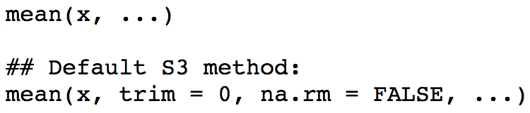
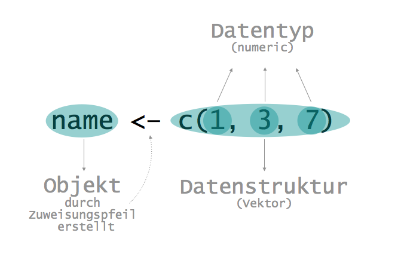

# Einführung in R

### Einleitung

<span class="r">R</span> ist eine kostenlose und quelloffene Statistiksoftware, die in Wissenschaft und Wirtschaft genutzt wird. Wir finden in <span class="r">R</span> eine Fülle an Funktionen, die uns (statistische) Berechnungen und grafische Visualisierungen ermöglichen.

<span class="r">R</span> ist die **grundlegende** Software, die unsere Berechnungen anstellt. <span class="r">RStudio</span> ist eine **zusätzliche** Entwicklungsumgebung, die uns die Arbeit mit <span class="r">R</span> vereinfacht.

Im Verlauf dieses Kapitels lernen wir, was **Funktionen und Pakete** sind und wie wir diese in <span class="r">R</span> nutzen. Danach schauen wir uns an, wie wir **Daten** speichern, um mit ihnen arbeiten zu können. Am Ende des Kapitels finden wir wesentliche **Kurzbefehle** für Windows und Mac und **weiterführende Hilfen**.

> *__Achtung__*: Voraussetzung zur Bearbeitung des Kapitels ist, dass wir (zumindest) [R installiert] [Installation] haben.

Weiterführend ist es sinnvoll, sich die [Einführung in RStudio] [Einführung in RStudio] anzuschauen.


```{r, echo=FALSE}
# http://md.psych.bio.uni-goettingen.de/mv/unit/block_intro/block_intro.html#diese_unterlagen_können_sich_bis_zum_start_der_einführungsblocks_im_april_2020_noch_verändern !!!!!!!!!!!!
```


## **1. Funktionen & Pakete**

Fangen wir damit an, was Funktionen und Pakete sind, warum wir diese nutzen und wie wir diese in <span class="r">R</span> anwenden können.

> *__Achtung__*:  Alles, was wir in einer Zeile hinter eine Raute (`#`) schreiben, wird <u>nicht</u> als Funktion, sondern als **Kommentar** interpretiert. Unseren Code zu kommentieren ist sehr nützlich, da es uns und Anderen die Nachvollziehbarkeit unseres Vorgehens erleichtert.

### Funktionen

```{r, echo=FALSE}
# Definition von wikipedia:
## https://de.wikipedia.org/wiki/Funktion_(Programmierung)
```

> Funktionen sind **(Unter)Programme**, die eine gewisse Funktionalität haben, d.h. eine **bestimmte Aufgabe** ausführen. 

<span class="highlight q">Warum ist es sinnvoll, Funktionen zu nutzen?</span>

<span class="ex">Wenn wir beispielsweise den Mittelwert einer Zahlenreihe errechnen wollen, nutzen wir folgenden Code:

```{r}
# Mittelwert der Zahlenreihe selbst berechnen
(4+3+6+2+3)/5
```

Dabei müssen wir die Zahlen aufsummieren und durch deren Anzahl teilen. Wenn wir weiter mit der Zahlenreihe arbeiten wollen, müssen wir sie außerdem wieder eingeben.</span>

Viel einfacher können wir die Aufgabe ausführen, indem wir vorgefertigte Funktionen nutzen.

```{r}
# Zahlenreihe (Vektor) erstellen
nums <- c(4, 3, 6, 2, 3)
nums

# Mittelwert errechnen lassen
mean(x = nums)
```

Wir können Funktionen **variierenden Input** übergeben. Dieser steht immer in Klammern direkt hinter der Funktion. <span class="ex">Beispielsweise könnten wir auch den Mittelwert einer anderen Zahlenreihe als `nums` berechnen.</span>

Den Input übergeben wir an einen <span class="highlight">Parameter</span>. Das ist eine (formale) *Variable* einer Funktion <font size="2">(z.B. <span class="code">mean(**x**)</span>)</font>, die in der Funktionsdefinition festgelegt ist. Der tatsächliche *Input* nennt sich <span class="highlight">Argument</span> <font size="2">(z.B. <span class="code">mean(x = **nums**)</span>)</font>. Die Parameter einer Funktion werden mit Kommata getrennt. Schematisch sieht eine Funktion somit folgendermaßen aus: <font size="2"><span class="code">function(parameter_1 = argument_1, parameter_2 = argument_2, ...)</span></font>

Werfen wir einmal einen Blick in die **Funktionsdefinition von `mean()`**:

```{r, out.width = "400px", echo=FALSE, fig.align='center'}

```

<aside>Die Funktionsdefinition finden wir in der Dokumentation, welche wir in <span class="r">RStudio</span> unter <a href="http://methods-berlin.com/wp-content/uploads/Einfuehrung_in_RStudio.html#files-plots-packages-help-viewer" target="_blank">**Help**</a> öffnen können.</aside>

Manche Parameter besitzen *voreingestellte Argumente* <font size="2"><span class="ex">(z.B. `na.rm=FALSE`)</font></span>, diese bezeichnet man als <span class="highlight">Defaults</span>. Funktionen mit (min. einem) Parameter *ohne* Default <span class="ex"><font size="2">(z.B. `mean()`)</font></span> werden ohne Spezifikation dieser nicht ausgeführt. <span class="ex">Beispielsweise *müssen* wir dem Parameter `x` einen Vektor, von dem wir den Mittelwert berechnen wollen, übergeben.</span>

Parameter ermöglichen uns aber nicht nur, eine Aufgabe mit verschiedenen Daten durchzuführen, sondern auch weitere Optionen zu wählen <span class="ex"><font size="2">(z.B. `na.rm`: Ausschluss von fehlenden Werten; `trim`: trimmen der Enden der Verteilung der Zahlenreihe vor Berechnung des Mittelwerts)</font></span>. 

<span class="ex">Wenn unsere Zahlenreihe beispielsweise fehlende Werte <font size="2">(in <span class="r">R</span>: `NA`)</font> besitzt, müssen wir den Default von `mean(..., na.rm=FALSE)` ändern, sodass fehlende Werte aus der Berechnung entfernt werden.</span>

```{r}
# fehlenden Wert hinzufügen
nums <- c(nums, NA)
nums

# Mittelwert errechnen lassen
mean(nums) # funktioniert nicht, weil unklar ist, was mit NA passieren soll
mean(nums, na.rm=TRUE) # funktioniert, weil NA aus Berechnung entfernt wird
```

<details><summary class="mtitle q">Wann können wir Parameternamen weglassen (wie bei `mean(nums)`)?</summary><div class ="more">
Wir müssen `x=nums` nicht ausschreiben, weil `x` der erste Parameter in der Funktionsdefinition ist, und unser Argument `num` automatisch dem Parameter `x` zugeordnet wird.

Das funktioniert mit jedem Argument solange wir die **Reihenfolge der Parameter in der Funktionsdefinition** beachten.

```{r, eval=FALSE}
mean(nums, TRUE) 
# funktioniert nicht (wir würden eine Fehlermeldung erhalten), ...
# ... weil trim (und nicht na.rm) an zweiter Stelle steht ...
# ... und trim numerischen Input (eine Zahl zwischen 0 und 0.5) ...
# ... und na.rm logischen Input (TRUE oder FALSE) verlangt
```

```{r}
mean(nums, 0, TRUE) 
```
</div></details>

```{r, echo=FALSE}
# https://www.learncpp.com/cpp-tutorial/why-functions-are-useful-and-how-to-use-them-effectively/
```
<p style="line-height:10px;"></p>

So erleichtern uns Funktionen unsere Arbeit. Zusammengefasst hat die Nutzung von Funktionen folgende Vorteile:

- <font color="#009193">**Organisation**</font>\
Programme <font size="2">(z.B. statistische Analysen)</font> können sehr komplex werden. Durch die Nutzung von Funktionen teilen wir unser komplexes Programm in mehrere, kleinere (Unter)Programme <span class="ex"><font size="2">(z.B. Vektor erstellen, Mittelwert berechnen, ...)</font></span>.
- <font color="#009193">**Wiederverwendbarkeit**</font>\
Wir können Funktionen immer wieder aufrufen. So wird unser Programm kompakter <font size="2">(**DRY**-Prinzip, Don't Repeat Yourself)</font> und wir reduzieren Fehler durch Kopieren von Code <span class="ex"><font size="2">(z.B. Verzählen bei den Elementen durch die wir teilen wollen)</font></span>.
- <font color="#009193">**Testen**</font>\
Weil wir weniger (redundanten) Code haben, können wir schneller Fehler finden <span class="ex"><font size="2">(z.B. Tippfehler, fehlende Elemente)</font></span>. 
- <font color="#009193">**Erweiterbarkeit**</font>\
Funktionen können erweitert werden, um verschiedene Szenarien zu händeln. Meist hat das schon jemand für uns gemacht. Wir müssen den Parametern einer Funktion nur verschiedene Argumente übergeben <span class="ex"><font size="2">(z.B. `na.rm=TRUE` zum Ausschluss von fehlenden Werten)</font></span>. 
- <font color="#009193">**Abstraktion**</font>\
Wir müssen die Funktion nicht im Detail verstehen. Es reicht zu wissen, wie der *Name* der Funktion ist <font size="2"><span class="ex">(`mean()`)</font></span>, welchen *Input* wir übergeben <font size="2"><span class="ex">(`x`; `trim` und `na.rm` optional weil mit Default)</font></span> und welchen *Output* <font size="2"><span class="ex">(arithmetisches Mittel)</font></span> wir bekommen und wo wir die Funktion finden, d.h. aus welchem *Paket* <font size="2"><span class="ex">(base)</font></span> sie stammt. All diese Informationen erhalten wir in der Dokumentation der Funktion z.B. in <span class="r">RStudio</span> unter <a href="http://methods-berlin.com/wp-content/uploads/Einfuehrung_in_RStudio.html#files-plots-packages-help-viewer" target="_blank">**Help**</a>.

Auf <a href="https://www.freecodecamp.org" target="_blank">freecodecamp.org</a> finden wir eine kurze Einführung zu <span class="r">R</span>: <a href="https://www.freecodecamp.org/news/r-programming-language-explained/" target="_blank"><span class="r">R</span> Programming Language explained</a>. Es lohnt sich, **vertiefend den Part zu <a href="https://www.freecodecamp.org/news/r-programming-language-explained/#functions-in-r" target="_blank">Funktionen</a> anzuschauen** <font size="2">(~ 10min)</font>, um ein besseres Verständnis für die Arbeit mit <span class="r">R</span> zu bekommen.


### Pakete

> Funktionen (und Dateien) werden in sogenannten Paketen gespeichert. Dabei sind in einem Paket (häufig) Funktionen, die für einen begrenzten Aufgabenbereich genutzt werden.

Es gibt <font color="#009193">**Standardpakete**</font>, die man automatisch mit dem Download von <span class="r">R</span> erhält und deren Funktionen und Dateien man einfach nutzen kann. Diese sind **base** <font size="2">(basale Funktionen wie z.B. `c()` und `mean()`, die wir gerade genutzt haben)</font>, **datasets** <font size="2">(Beispieldatensätze)</font>, **graphics** <font size="2">(Grafiken erstellen)</font>, **grDevices** <font size="2">(Farben und Schriften)</font>, **methods** <font size="2">(Methoden und Klassen erstellen bzw. Informationen erhalten)</font>, **stats** <font size="2">(statistische Methoden)</font> und **utils** <font size="2">(z.B. Informationen zu Add-On Paketen erhalten und diese herunterladen)</font>.

<span class="ex">Zum Beispiel können wir mit der Funktion `data()` auf die in **datasets** enthaltenen Datensatze zugreifen. </font>

<aside>data {utils}</aside>

```{r}
data(women) 
```

Die Größe des Datensatzes sehen wir mit `dim()`.

<aside>dim {base}</aside>

```{r}
dim(women)
```

<span class="ex">Der Datensatz **women** enthält 15 Fälle <font size="2">(Zeilen)</font> und zwei Variablen <font size="2">(Spalten)</font>.</font> 

Die Namen der Variablen erfahren wir mit `names()`.

<aside>names {base}</aside>

```{r}
names(women)
```


Mit den Funktionen aus den Standardpaketen können wir schon vieles machen. Weil <span class="r">R</span> **open-source** ist, kann jeder eigene Pakete schreiben und Anderen zugänglich machen. Wir können auf diese <font color="#009193">**Add-on Pakete**</font>, die andere <span class="r">R</span>-NutzerInnen erstellt haben, über <a href="https://cran.r-project.org" target="_blank">CRAN</a> <font size="2">(Comprehensive R Archive Network)</font> zugreifen. Natürlich können wir selbstgeschriebene Funktionen, die wir häufig nutzen, auch in eigenen Paketen speichern, um sie unkompliziert wieder nutzen zu können oder sie der <span class="r">R</span>-Community zur Verfügung zu stellen.

Add-on Pakete müssen wir einmalig **herunterladen** und jedes Mal, wenn wir sie (in einer <span class="r">R</span>-Session) nutzen wollen, **laden**.

<span class="ex">Ein bei PsychologInnen beliebtes Paket ist **psych**. Dieses enthält Funktionen, die häufig in der Persönlichkeitspsychologie und Psychometrie genutzt werden.</span>

Wir können ein Add-on Paket mit folgendem Befehl **herunterladen**:

```{r, eval=FALSE}
install.packages("psych") # auf Anführungszeichen achten!
```

<span class="ex">Die im Paket enthaltene Funktion `describe()` gibt uns beispielsweise eine kompakte Übersicht relevanter deskriptiv-statistischer Kennwerte von Daten aus. 

<!--Die Daten müssen dafür zweidimensional sein <font size="2">(d.h. als Matrix oder Data Frame vorliegen)</font>.</span>   # laut Dok, aber funktioniert auch bei Vektoren 
<aside>Mehr Informationen zur Organisation von Daten später unter [Datenstrukturen].</aside>
-->

Wenn wir enthaltene Funktionen nutzen wollen, müssen wir das Paket zuerst **laden**.

```{r}
library(psych) # keine Anführungszeichen notwendig
describe(women)
```

<!-- <aside>**women** ist ein Datensatz aus dem Basispaket **datasets**, den wir mit der Funktion `data()`, aus dem Basispaket **utils**, in unser <a href="http://methods-berlin.com/wp-content/uploads/Einfuehrung_in_RStudio.html#environment-history" target="_blank">**Environment**</a> holen können, um damit zu arbeiten.</aside> -->

<span class="ex">Mit `describe` erhalten wir folgende Informationen zu jeder Variable im Data Frame bzw. Matrix: Namen, Spaltennummer (`vars`), Anzahl (gültiger) Fälle (`n`), Mittelwert (`mean`), Standarabweichung (`sd`), Median (`median`), getrimmter Mittelwert (`trimmed`), Median Absolute Deviation (`mad`), Minimum (`min`), Maximum (`max`), Schiefe (`skew`), Exzess (`kurtosis`) und Standardfehler des Mittelwerts (`se`).</span>

<aside>Diese Informationen finden wir in der Dokumentation, welche wir unter <a href="http://methods-berlin.com/wp-content/uploads/Einfuehrung_in_RStudio.html#files-plots-packages-help-viewer" target="_blank">**Help**</a> in <span class="r">RStudio</span> ansehen können.</aside>

Wenn wir <span class="r">R</span> bzw. <span class="r">RStudio</span> schließen und erneut öffnen, müssen wir zusätzliche Pakete vor der Nutzung erneut laden.

Für **mehr Informationen zu Paketen**, u.a. wie wir diese aktualisieren können, könnt ihr euch dazugehöriges [Kapitel] [Pakete] anschauen.


## **2. Daten**

Um zu verstehen, wie <span class="r">R</span> arbeitet, benötigen wir ein Verständnis dafür, wie Daten in <span class="r">R</span> repräsentiert werden. Dazu schauen wir uns drei wichtige Konzepte an: **Datentypen**, **Datenstrukturen** und **Objekte**.

Bevor wir uns die einzelnen Konzepte im Detail anschauen, sehen wir nachfolgend eine Veranschaulichung des Zusammenhangs dieser, um bereits eine grobe Vorstellung zu haben, was uns in den folgenden Abschnitten erwartet.

```{r, out.width = "500px", fig.align="center", echo=FALSE}

library(dplyr)
library(kableExtra)
```


```{r, echo=FALSE, eval=FALSE}
# https://swcarpentry.github.io/r-novice-inflammation/13-supp-data-structures/
# https://cran.r-project.org/doc/manuals/r-release/R-intro.html#Simple-manipulations-numbers-and-vectors
# https://cran.r-project.org/doc/manuals/r-release/R-intro.html#Objects
## R Dev Team: (Data) Types, Data Structures, Objects

library(kableExtra)
library(dplyr)

table_data <- as.data.frame(matrix(c("Zeichen", "z.B. \"b\" oder '@'", "Vergleich", "<span style=\"font-family: Consolas,monaco,monospace;\">character</span>", 
                                     "Wahrheitswerte", "wahr, falsch", "UND, ODER, NICHT", "<span style=\"font-family: Consolas,monaco,monospace;\">logical</span>", 
                                     "Ganze Zahlen", "z.B. 2", "Addition, Subtraktion, Multiplikation, Division", "<span style=\"font-family: Consolas,monaco,monospace;\">integer</span>", 
                                     "Kommazahlen", "z.B. 3.4", "Addition, Subtraktion, Multiplikation, Division", "<span style=\"font-family: Consolas,monaco,monospace;\">numeric</span>", 
                                     "Komplexe Zahlen","z.B. 1+i", "Addition, Subtraktion, Multiplikation, Division", "<span style=\"font-family: Consolas,monaco,monospace;\">complex</span>"
                                     ),
                                   nrow = 5, byrow = TRUE))
colnames(table_data) <- c("Allgemeiner Datentyp", "Werte", "Operationen", "(Primitiver) Datentyp in 
                                     <span style=\"font-family: Consolas,monaco,monospace;\">R</span>")

table_data %>%
  kable("html", align="c", escape=FALSE) %>%
  kable_styling(position="center") %>%
  row_spec(0, color = "white", background = "#009193") %>%   # bold=FALSE funzt nicht
  column_spec(4, bold=TRUE) %>%
  collapse_rows(columns = 3, valign = "middle")
```

> *__Achtung__*:  Die Gliederung nach "Datentyp" und "Datenstruktur" sind getreu des <a href="https://cran.r-project.org/doc/manuals/r-release/R-intro.html" target="_blank">Manuals</a> von <span class="r">R</span>. Man stößt in anderen Quellen teils auf abweichende Benennungen.

### Datentypen

> Der Datentyp gibt die Art der Daten an, d.h. welche konkreten **Werte**(bereiche) die Daten annehmen können und welche **Operationen** darauf anwendbar sind.

Wir beschäftigen uns in <span class="r">R</span> zumeist mit den folgenden Datentypen: <span class="r">**character**</span>, <span class="r">**logical**</span>, <span class="r">**integer**</span> und  <span class="r">**double**</span>. Die letzten beiden werden (häufig) als <span class="r">**numeric**</span> zusammengefasst.

Nachfolgend finden wir eine Übersicht dieser Datentypen.

```{r, echo=FALSE}
# Tab auch in Skript DP
table_data <- as.data.frame(matrix(c("Zeichen(ketten)", "z.B. \"Ball\" oder '@'", "gleich oder ungleich", "<span style=\"font-family: Consolas,monaco,monospace;\">character</span>", "",
                                     "Wahrheitswerte", "TRUE, FALSE", "(einige) Logische Operatoren", "<span style=\"font-family: Consolas,monaco,monospace;\">logical</span>", "<span style=\"display:none;\">_</span>",
                                     "Ganze Zahlen", "z.B. 2", "Arithmetische und Logische Operatoren", "<span style=\"font-family: Consolas,monaco,monospace;\">integer</span>", "<span style=\"font-family: Consolas,monaco,monospace;\">numeric</span>",
                                     "Kommazahlen", "z.B. 3.4", "Arithmetische und Logische Operatoren", "<span style=\"font-family: Consolas,monaco,monospace;\">double</span>", "<span style=\"font-family: Consolas,monaco,monospace;\">numeric</span>"
                                     ),
                                   nrow = 4, ncol=5, byrow = TRUE))
colnames(table_data) <- c("Art der Daten", "Werte", "Operationen", "Datentyp in <span style=\"font-family: Consolas,monaco,monospace;\">R</span>", "")

table_data %>%
  kable("html", align="c", escape=FALSE) %>%
  kable_styling(position="center") %>%
  row_spec(0, color = "white", background = "#009193") %>%   # bold=FALSE funzt nicht
  column_spec(5, bold=TRUE, background = "#ECECEC",) %>%
  row_spec(1:2, background = "white") %>%
  column_spec(4, bold=TRUE, background = "#ECECEC", width="8em") %>%
  collapse_rows(columns = 5, valign = "middle") %>%
  collapse_rows(columns = 3, valign = "middle")
```

<aside>\
\
\
Es gibt in <span class="r">R</span> noch zwei weitere Datentypen, mit denen wir uns aber nicht weiter beschäftigen werden: <span class="r">complex</span> und <span class="r">raw</span>.</aside>

> *__Achtung__*:  Kommazahlen werden mit **.** und nicht mit **,** dargestellt, weil Kommata genutzt werden, um Argumente einer Funktion voneinander zu trennen.

```{r, echo=FALSE}
# welche log und arithm Operatoren:
## https://www.statmethods.net/management/operators.html
```

<details><summary class ="mtitle">Logische Operatoren in <span class="r">R</span></summary><div class="more">
Ein logischer Operator ist ein Operator, dessen Ergebnis ein Wahrheitswert (<span class="r">logical</span>; `TRUE` oder `FALSE`) ist. <!--Wir können logische Operatoren auf Daten vom Typ$^1$ <span class="r">numeric</span>, aber auch selbst auf Daten vom Typ <span class="r">logical</span> anwenden. -->

```{r, echo=FALSE}
# beide Tabellen ähnlich wie von
## https://www.statmethods.net/management/operators.html

Operator <- c("<", "<=", ">", ">=", "==", "!=", "!", "| oder ||", "& oder &&")
Vergleich <- c("kleiner", "kleiner gleich", "größer", "größer gleich",
              "(genau) gleich", "ungleich", "nicht (Negation von Bedingungen)",
              "oder", "und")
Beispiel <- c("1 < 1<br>FALSE", "1 <= 1<br>TRUE", "2 > 1<br>TRUE", 
              "1 >= 3<br>FALSE", "TRUE == FALSE<br>FALSE",
              "TRUE != FALSE<br>TRUE", "!TRUE<br>FALSE", "5 > 3 | 5 == 4<br>TRUE",
              "5 > 3 & 9 < 8<br>FALSE")

tab <- data.frame(Operator, Vergleich, Beispiel)

tab %>%
  kable("html", align="l", escape=FALSE, table.attr = "style='width:100%;'") %>%
  kable_styling(full_width = T) %>%
  row_spec(0, color = "white", background = "#009193") %>%
  column_spec(3, background = "#ECECEC") %>%
  column_spec(1:2, background = "white")

# wir schauen uns hier nur solche logischen vektoren an, die Vektoren beliebiger Länge annehmen können z.B. & anstatt &&; zweiteres bewertet nur das erste Element in jedem Argument
## https://riptutorial.com/de/r/example/13276/logische-operatoren
```

<!--
$^1$ Es gibt hierbei eine kleine Inkonsistenz zwischen Manual und Dokumentation:\
Laut dem <a href="https://cran.r-project.org/doc/manuals/r-release/R-intro.html#Logical-vectors" target="_blank">Manual</a> sind `==` und `!=` logische Operatoren. In der Dokumentation der logischen Operatoren (`?"&"`) tauchen sie aber nicht auf; nur in der Dokumentation der allgemeinen Syntaxoperatoren (`?Syntax`). In der Dokumentation der logischen Operatoren steht nicht, dass man diese auf Elemente des Typs <span class="r">character</span> anwenden kann. Wir können `==` und `!=` aber auf <span class="r">character</span> anwenden, um zu testen, ob zwei Elemente (z.B. `"a"` und `"A"`) gleich (`"a" == "A"` `FALSE`) bzw. ungleich (`"a" != "A"` `TRUE`) sind.  -->
</div></details>

<p style="line-height:10px;"></p>

<details><summary class ="mtitle">Arithmetische Operatoren in <span class="r">R</span></summary><div class="more">
Über (die meisten) arithmetischen Operatoren sind wir wohl schon zu Grundschulzeiten gestoßen. Das sind Operatoren, die wir zum Rechnen mit Zahlen (<span class="r">numeric</span>) benötigen. 

```{r, echo=FALSE}
Operator <- c("<span style=\"display:none;\">.</span>+", "<span style=\"display:none;\">.</span>-", "<span style=\"display:none;\">.</span>*", "/", "^ oder **", "%%", "%/%")
Rechenoperation <- c("Addition", "Subtraktion", "Multiplikation", "Division",
              "Exponenzieren", "ganzzahliger Rest bei der Division (Modulo)", 
              "ganzzahliger Quotient")
Beispiel <- c("1 + 1<br>2", "4 - 3<br>1", "2 * 3<br>6", "5 / 3<br>1.666667",
              "8^2<br>64",
              "5 %% 3<br>2", "5 %/% 3<br>1")

tab <- data.frame(Operator, Rechenoperation, Beispiel)
# tab <- as.data.frame(matrix(c(Operator, Rechenoperation), byrow=T, nrow=2))

tab %>%
  kable("html", align="l", escape=FALSE, table.attr = "style='width:100%;'") %>%
  kable_styling(full_width = T) %>%
  row_spec(0, color = "white", background = "#009193") %>%
  column_spec(3, background = "#ECECEC") %>%
  column_spec(1:2, background = "white")
```
</div></details>

#### Messniveaus und Datentypen

<details><summary class ="mtitle">Recap: Messniveaus</summary><div class="more">
Das Messniveau (oder auch Skalenniveau) ist eine wichtige Eigenschaft von Merkmalen (Variablen) von Untersuchungseinheiten. Es beschreibt, welche Informationen in unseren Messwerten abgebildet werden und damit auch welche mathematischen Transformationen mit den Messwerten sinnvoll sind (z.B. das Berechnen von Mittelwerten). Somit begrenzt das Messniveau auch die zulässigen Datenauswertungsverfahren unserer Variablen.

Die Kodierung von <font color="#009193">**nominalskalierten**</font> Merkmalen ist insofern willkürlich, als dass lediglich auf **Gleichheit versus Ungleichheit** geachtet werden muss <font size="2">(z.B. `1`, `4`, `9` *oder* `A`, `Y`, `M`)</font>.

Die Kodierung von <font color="#009193">**ordinalskalierten**</font> Merkmalen geschieht der Größe nach, d.h. dass die **Rangfolge** der Kodierungen einzelner Gruppen relevant ist (z.B. `1` < `4` < `9` *oder* `A` < `M` < `Y`). Man kann aber auch eine eigene Sortierung festlegen, die nicht der "natürlichen" Rangfolge (Zahlen: aufsteigend; Buchstaben: alphabetisch) entspricht (z.B. `Y` < `A` < `M`). Ein Realschulabschluss ist beispielsweise besser als ein Hauptschulabschluss. Wir können aber nicht festlegen, *wie viel besser* er ist. 

Bei der Kodierung von <font color="#009193">**intervallskalierten**</font> Merkmalen sind sowohl die Rangfolge als auch die **Abstände** zwischen den Ausprägungen relevant <font size="2">(z.B. `1`, `4`, `7`; jeweils mit gleichem Abstand zueinander; *oder* `1.4`, `1.5`, `2.3`; jeweils mit verschiedenen Abständen zueinander)</font>. Ein Beispiel dafür ist die Temperatur in Grad Celsius oder Grad Fahrenheit.

Bei der Kodierung von <font color="#009193">**verhältnisskalierten**</font> Merkmalen ist zusätzlich noch ein **Nullpunkt** vorhanden. Dieser erlaubt es, dass Quotienten zwischen Werten gebildet werden können. Ein beliebtes Beispiel ist die Kelvin Skala. Bei dieser ist bei 0°K keine Bewegungsenergie mehr vorhanden und 20°K sind halb so viel wie 40°K.

Zu guter Letzt gibt es noch <font color="#009193">**absolutskalierte**</font> Merkmale, welche sowohl einen eindeutigen Nullpunkt als auch eine **eindeutige Einheit** der Skala <font size="2">(z.B. Anzahl der Kinder)</font> vorweisen kann. Die Kodierung entspricht der natürlichen Einheit.

Nachfolgend finden wir eine Tabelle der möglichen Unterscheidungen der jeweiligen Messniveaus.

```{r, echo=FALSE}
# https://haozhu233.github.io/kableExtra/awesome_table_in_html.html#column__row_specification

table <-
  matrix(
    c(
      "X", "", "", "", "",
      "X", "X", "", "", "",
      "X", "X", "X", "", "",
      "X", "X", "X", "X", "",
      "X", "X", "X", "X", "X"
    ),
    nrow = 5,
    ncol = 5,
    byrow = T
  )
colnames(table) <- c("<span style=\"line-height:0.1;\">(Un-)\nGleichheit</span>", "Rangordnung", "Abstände", "Verhältnisse", "natürliche\nEinheit")
rownames(table) <- c("Nominal", "Ordinal", "Intervall", "Verhältnis", "Absolut")

kable(table, "html", escape = F) %>%
  kable_styling(full_width = T) %>%
  column_spec(2:6, width="7em") %>%
  column_spec(1,        
              bold = T,
              color = "white",
              background = "#009193") %>%
  row_spec(0,  extra_css = "line-height:1.5;",
           bold = T,
           color = "white",
           background = "#009193")
```

```{r, out.width = "400px", fig.align="center", echo=FALSE}
knitr::include_graphics("figures/Einführung/Bilder/R/Skalenniveau.png")
```

<div style="text-align: center"><font size="1">Bildquelle: https://de.wikipedia.org/wiki/Datei:Skalenniveau.png</font></div>

</div></details>

<p style="line-height:10px;"></p>

Die verschiedenen Messniveaus können mit unterschiedlichen Datentypen repräsentiert werden. Hauptsächlich nutzt man dafür <span class="r">**character**</span> und <span class="r">**numeric**</span>. Nachfolgend finden wir eine Übersicht der möglichen Kodierungen der Messniveaus.

```{r, echo=FALSE}
De <- rep("Datentyp:", 2)
D <- c("<span style=\"font-family: Consolas,monaco,monospace;\">character</span>", "<span style=\"font-family: Consolas,monaco,monospace;\">numeric</span>")
N <- c("X", "X$^1$")
O <- c("X$^2$", "X$^2$")
I <- c("", "X")
V <- c("", "X")
A <- c("", "X")

table_kat <- data.frame(De, D, N, O, I, V, A)
colnames(table_kat) <- c("", "", "Nominal-", "Ordinal-", 
              "Intervall-", "Verhältnis-", "Absolut-")

table_kat %>%
  kable("html", align="c", escape=FALSE, table.attr = "style='width:100%;'") %>%
  add_header_above(c("<span style=\"display:none;\">_</span>"=2 , "Art der Skala:" = 5), line=F, color = "white", background = "#009193", escape=FALSE) %>% 
  kable_styling(full_width = T) %>%
  row_spec(0, color = "white", background = "#009193") %>%
  column_spec(1:2, bold=TRUE, color = "white", background = "#009193") %>%
  collapse_rows(columns = 1, valign = "middle") %>%
  footnote(general = "<font size=\"1\">$^1$ Faktorisieren (unordered factor) notwendig *wenn* keine Indikatorvariable(n) genutzt $^2$ Faktorisieren (ordered factor) notwendig</font>", general_title = "", escape = FALSE) 
```

<aside>\
\
\
\
\
Ein Faktor ist eine Art von Vektor. Mehr dazu im nächsten Abschnitt.</aside>

<details><summary class ="mtitle q">Können Merkmale auch mit <span class="r">logical</span> kodiert werden?</summary><div class="more">
Wir könnten auch logische Werte nutzen, um Merkmale zu kodieren, allerdings kann es sich dabei nur um **dichotome nominalskalierte** Merkmale handeln (d.h. diese können nur zwei diskrete Ausprägungen besitzen). 

Logische Werte und Operatoren kommen hauptsächlich in der **Indexierung von Vektoren** (diese lernen wir im nächsten Abschnitt kennen) ...

```{r}
x <- c(7,4,3,6,1) # Vektor x erstellen
x
# Welche Elemente in Vektor x sind größer als 5? 
x > 5 # Output: logischer Vektor (mit T/F zu jedem Element) ...
x[x > 5] # ... den wir auf x anwenden können, um die Elemente zu erhalten.
```

... und der **konditionalen Programmierung** vor. 

```{r}
for (i in 1:length(x)) { # Für jedes Element in x, begonnen bei 1 ...
  if (x[i] > 5) {         # ... wenn i-tes Element in x größer als 5 ...
    x[i] = x[i] * 2         # ... multipliziere Element mit 2
  }
}
x
```

Damit werden wir uns erst später beschäftigen. Anwendung findet die konditionale Programmierung z.B. wenn wir subsetten, d.h. Elemente, auf die eine *Kondition* (z.B. größer als 5) zutrifft, einer Datenstruktur (z.B. Vektor, Matrix, Dataframe) entnehmen wollen.
</div></details>


### Datenstrukturen

```{r, echo=FALSE}
# http://adv-r.had.co.nz/Data-structures.html
```

> Die Datenstruktur bestimmt die **Organisation** und **Speicherung** von Daten(typen), und folglich auch, welche Funktionen wir anwenden können.

Datenstrukturen können nach Dimensionalität und enthaltenen Datentypen klassifiziert werden. Nachfolgend befindet sich eine Übersicht der in <span class="r">R</span> enthaltenen Datenstrukturen.

```{r, echo=FALSE, layout="l-body-layout"}
x <- c(rep("Anzahl der Dimensionen", 3))
y <- c("1", "2", "n")
ho <- c("Vektor", "Matrix", "Array")
he <- c("Liste", "Data Frame", "")

table_data_2 <- data.frame(x,y,ho,he)
colnames(table_data_2) <- c("", "", "nein (homogen)", "ja (heterogen)")

table_data_2 %>%
  kable("html", align="c", escape=FALSE, table.attr = "style='width:100%;'") %>%
  kable_styling(full_width = T) %>%
  row_spec(0, color = "white", background = "#009193") %>%
  add_header_above(c("<span style=\"display:none;\">_</span>"=2, "Beinhaltet unterschiedliche Datentypen?"=2), escape=F, line=F,
                     color = "white", background = "#009193") %>%
  column_spec(1:2, bold=TRUE, color = "white", background = "#009193") %>%
  column_spec(1, width = "10em") %>%
  collapse_rows(columns = 1, valign = "middle")
```

<aside>\
\
\
\
Aus Platzgründen werden wir Arrays im Folgenden nicht behandeln.</aside>

#### Vektor

Vektoren sind die **elementare** Datenstruktur, aus der sich alle anderen Datenstrukturen zusammensetzen. Sie besitzen nur eine Dimension. Mit `c()` können wir Vektoren erstellen. 

Generell können sie unterschiedlichen Typs sein ...

```{r}
vek_1 <- c("A", 'B')  # egal ob " oder ' 
vek_2 <- c(F, T, T)  # Abkürzung von FALSE und TRUE
```

... aber ein Vektor kann nur **einen Datentyp** beinhalten.

```{r}
vek_3 <- c(1, "3")  # alles wird zu character
```

Zahlen können wir auf unterschiedliche Weisen speichern.

```{r}
vek_4 <- c(1, 2, 3) # ganze Zahlen
vek_5 <- c(1.3, 4.5) # Kommazahlen
vek_6 <- c(1L, 4L) # ganze Zahlen
```

Mit `str()` können wir uns den **Datentyp**, die **Länge** der Dimension <font size="2">(Anzahl der Elemente)</font> und die **ersten 10 Elemente** ausgeben lassen.

```{r}
str(vek_1)
# chr --> Datentyp character
# [1:2] --> enthält zwei Elemente
# "A" "B" --> ersten zwei (von max. 10) Elementen
```


```{r}
str(vek_2)
str(vek_3)
str(vek_4)
str(vek_5)
str(vek_6)
```

<details><summary class ="mtitle q">Warum sind die numerischen Vektoren nur vom Typ <span class="r">numeric</span> oder <span class="r">integer</span>?</summary><div class="more">
Bei Betrachtung der numerischen Vektoren fällt auf, dass `vek_4` und `vek_5` als <span class="r">numeric</span> und `vek_6` als <span class="r">integer</span> gespeichert wurden.

**Aber warum wurden `vek_4` und `vek_5` als <span class="r">numeric</span> gespeichert, obwohl wir <span class="r">integer</span> (ganze Zahlen) bzw. <span class="r">double</span> (Kommazahlen) erwartet hätten?**

Das liegt daran, dass <span class="r">R</span> *alle Zahlen* (d.h. ganze, reelle und komplexe Zahlen) als <span class="r">numeric</span> zusammenfasst (wie bereits in der Einführung zu [Datentypen] erwähnt), *solange* wir diese nicht explizit (als <span class="r">integer</span>) definieren.

Genau genommen lautete der **exakte Datentyp** von ganzen und reellen Zahlen, die als <span class="r">numeric</span> zusammengefasst sind, <span class="r">double</span>. Mit `typeof()` sehen wir diesen. 

```{r}
typeof(vek_4)
typeof(vek_5)
```

**Warum <span class="r">double</span> (und nicht <span class="r">integer</span>)?**

Wenn wir arithmetische Operatoren (v.a. Division) anwenden, dann werden unsere ganzen Zahlen zu Kommazahlen. Daher werden ganze *und* gebrochene Zahlen in <span class="r">numeric</span> "präventiv" als <span class="r">double</span> gespeichert.

**Und warum ist `vek_6` vom Typ <span class="r">integer</span>?**

Hier haben wir mit dem `L` hinter den (ganzen) Zahlen (`c(1L, 4L)`) *explizit festgelegt*, dass wir diese als <span class="r">integer</span> speichern wollen.

Wenn wir **<span class="r">integer</span>**-Zahlen**folgen** erstellen wollen, können wir das auch mit <span class="code"><span class="ex">Anfang</span>:<span class="ex">Ende</span></span> machen.

```{r}
vek_7 <- 2:5
vek_8 <- c(6:9, 1:4)
```

```{r}
str(vek_7)
str(vek_8)
```

Generell reicht für uns aber die Unterscheidung zwischen <span class="r">numeric</span> und den anderen, nicht-numerischen Datentypen. Ob <span class="r">integer</span> oder <span class="r">double</span> ist zumeist nicht von Relevanz.
</div></details>
<p style="line-height:10px;"></p>

Wenn wir **Zahlenfolgen** <font size="2">(<span class="r">numeric</span>)</font> erstellen wollen, können wir `seq()` nutzen.

```{r}
# seq(from,to,by)
vek_9 <- seq(1,10,2)
vek_10 <- seq(1,10,0.5)
```

```{r}
str(vek_9)
str(vek_10)
```

Wenn wir wollen, dass sich **Elemente wiederholen**, können wir die Funktion `rep()` nutzen.

```{r}
# rep(x, times)
vek_11 <- rep("A", 10)
vek_12 <- c(rep(1, 3), rep(2:3, 3))
```

```{r}
str(vek_11)
str(vek_12)
```

<details><summary class="mtitle q">Wie genau funktioniert `rep()`?</summary><div class="more">
Dem Parameter `x` übergeben wir die Zeichen(folge), die wir wiederholen wollen; `times` übergeben wir die Anzahl der Wiederholungen der Zeichen*folge* bzw. `each` die Anzahl der Wiederholungen der *einzelnen Zeichen*.

Die Zahl `1` wird 10 mal (`times`) wiederholt:

```{r}
rep(1, 10) # das gleiche wie: rep(x=1, times=10)
```

Die Zahlenfolge `0, 1` bzw. die Zeichenfolge `"A", "B` wird 10 mal (`times`) wiederholt:

```{r}
rep(0:1, 10)
rep(c("A", "B"), 10)
```

Wenn wir *erst* 10 mal die `0` bzw. `"A"` und *anschließend* 10 mal die `1` bzw. `"B"` haben wollen, nutzen wir den Parameter `each`.

```{r}
rep(0:1, each=10) # das gleiche wie c(rep(0, 10), rep(1, 10))
rep(c("A", "B"), each=10)
```
</div></details>
<p style="line-height:10px;"></p>

Durch **Indexierung** via `[]` können wir uns einzelne Elemente ausgeben lassen.

```{r}
vek_1[2] # zweites Element
vek_5[1] # erstes Element
```

##### Spezialfall Faktor

```{r, echo=FALSE}
# https://cran.r-project.org/doc/manuals/r-release/R-intro.html#Factors
```


Ein Faktor ist ein spezieller Vektor, der genutzt wird, um **diskrete Klassifikationen** zu kodieren.

Mit der Funktion `factor()` können wir Vektoren in ungeordnete und geordnete Faktoren umwandeln.

**Unsortierte** Faktoren können **nominalskalierte** Merkmale kodieren.

```{r}
# Vektor erstellen
x <- c(1,3,2,3,2)
y <- c("f", "B", "c", "b", "c")

nominal_x <- factor(x)
nominal_y <- factor(y)
```

```{r}
str(nominal_x)
str(nominal_y)
```

Die Zahlen hinter den Ausprägungen zeigen die *interne* Kodierung. Bei numerischen Vektoren wie `nominal_x` entsprechen diese auch den möglichen Ausprägungen.

**Sortierte** Faktoren können **ordinalskalierte** Merkmale kodieren. Um Faktoren zu sortieren, müssen wir dem Parameter `ordered` das Argument `TRUE` übergeben.

```{r}
ordinal_x <- factor(x, ordered=TRUE)
ordinal_y <- factor(y, ordered=TRUE)
```

```{r}
str(ordinal_x)
str(ordinal_y)
```

Wie wir sehen wurde automatisch eine Sortierung festgelegt. Zahlen werden standardmäßig **aufsteigend**; Zeichen **alphabetisch** sortiert (wobei Kleinbuchstaben vor Großbuchstaben auftauchen). Bei den unsortierten Faktoren gab es diese Sortierung auch bereits, allerdings wird diese *nur* zum Darstellen der Ausprägungen genutzt (bei `nominal_` sind die Ausprägungen mit `,` getrennt; bei `ordinal_` mit `<`).
 
Mit dem Parameter `levels` können wir auch **eigene Sortierungen** festlegen. Das übergebene Argument muss selbst ein Vektor mit den möglichen Ausprägungen sein.

```{r}
ordinal_x.2 <- factor(x, ordered=TRUE, levels=c(3,2,1))
ordinal_y.2 <- factor(y, ordered=TRUE, levels=c("B", "f", "b", "c"))
str(ordinal_x.2)
str(ordinal_y.2)
```

Jetzt sehen wir auch, dass sich (mit einer anderen als der natürlichen Sortierung) auch die internen Kodierungen geändert haben.

#### Matrix

Matrizen sind **zweidimensionale Vektoren**, die nur **einen Datentyp** beinhalten können. In mathematischen Kontexten werden Matrizen uns häufiger begegnen. 

Wir erstellen sie mit `matrix(data, nrow, ncol)`.

```{r}
mat_1 <- matrix(data=c(1,2,3,4), # Daten-Vektor
                nrow=2, # Anzahl Zeilen
                ncol=2, # Anzahl Spalten
                # eine Angabe (Zeilen oder Spalten) reicht auch
                byrow=TRUE) # reihenweise Eintragen der Daten
```


```{r}
mat_1
str(mat_1) # [Länge Zeilen, Länge Spalten]
```


Wenn wir einzelne Elemente indexieren wollen, müssen wir **zwei Indizes** angeben, weil Matrizen zweidimensional sind.

<aside>**Z**uerst die **Z**eile,\
dann die Spalte.</aside>

```{r}
# [Zeile, Spalte]
mat_1[1,2] # Zeile 1, Spalte 2
mat_1[2,1] # Zeile 2, Spalte 1
```

Wir können auch nur einen Index angeben, um uns die komplette Zeile bzw. Spalte ausgeben zu lassen. Dabei müssen wir aber daran denken, das Komma zu setzen!

```{r}
mat_1[1,] # komplette erste Zeile
mat_1[,2] # komplette zweite Spalte
```


Zusätzlich können wir die Spalten und Zeilen von Matrizen benennen. 

```{r}
colnames(mat_1) <- c("A", "B") # Spalten benennen
rownames(mat_1) <- c("Vpn_1", "Vpn_2")
mat_1
```


#### Liste

```{r, echo=FALSE}
# https://cran.r-project.org/doc/manuals/r-release/R-intro.html#Lists
# Listen können auch aus Listen bestehen --> too deep
```

Listen bestehen aus **geordneten** Sammlungen von Objekten (Komponenten) **unterschiedlichen Datentyps**. Diese Objekte können wiederum selbst Vektoren, Matrizen oder Dataframes sein. Listen haben nur eine Dimension.

Mit `list()` können wir eigene Listen erstellen.

```{r}
list_kurs <- list(kurs="Programmieren",
                  teilnehmer=3,
                  namen.teilnehmer=c("Tina", "Paul", "Lena"),
                  vorerfahrung=c(T, F, F))
list_kurs
```


```{r}
str(list_kurs) # "List of ..." gibt die Länge der (einen) Dimension der Liste an
```


Wir können Komponenten bzw. ihre Elemente auf verschiedene Arten **indexieren**.

```{r}
list_kurs[3] # Name und Elemente der dritten Komponente
list_kurs[[3]] # nur Elemente der dritten Komponente
list_kurs[[3]][2] # zweites Element der dritten Komponente
```

Wir können alle Elemente einer Komponente ebenso mit ihren Namen extrahieren.

```{r}
list_kurs$vorerfahrung
```

```{r, echo=FALSE}
# list_kurs$v würde ausreichen; 
# 'minimum number of letters needed to identify them uniquely'
```

Listen werden uns häufiger als Output statistischer Funktionen begegnen.

#### Data Frame

In der Psychologie arbeiten wir zumeist mit Data Frames. Diese haben, wie Matrizen, zwei Dimensionen, aber sie können auch **unterschiedliche Datentypen** beinhalten.

Um Data Frames zu erstellen, spezifizieren wir zuerst Vektoren (unterschiedlichen Typs) und führen diese dann mit `data.frame()` zusammen.

```{r}
# Vektoren erstellen: 
eins <- c(1, 3, 2, 1) 
zwei <- c("A", "A", "B", "B")

# in Data Frame zusammenführen
df_1 <- data.frame(eins, zwei)
```


```{r}
df_1
str(df_1) # obs. = Länge Zeilen, variables = Länge Spalten
```

Die Benennung der Vektoren wird als Spaltenbenennung übernommen. Per Default werden Daten vom Typ <span class="r">character</span> (z.B. `zwei`) als Faktoren gespeichert <font size="2">(`stringsAsFactors = default.stringsAsFactors()`, was wiederum `TRUE` ist)</font>.

Mit `colnames()` bzw. `rownames()` können wir wieder Spalten- bzw. Zeilennamen ändern bzw. hinzufügen.

```{r}
colnames(df_1) <- c("AV", "UV")
rownames(df_1) <- c("Fall_1", "Fall_2", "Fall_3", "Fall_4")
# mit data.frame(..., row.names) könnten wir auch initial Zeilennamen übergeben
df_1
```

Wir können mit Indexieren wieder einzelne Elemente oder Spalten bzw. Zeilen extrahieren. Spalten bzw. Zeilen können wir hier auch mit ihren Namen ansprechen.

```{r}
df_1[3,2] # dritte Zeile, zweite Spalte
df_1["Fall_3", "UV"] # dritte Zeile, zweite Spalte
df_1[1,] # erste Zeile
df_1["Fall_1",] # erste Zeile
```


**Spalten** können wir uns auch mit dem \$-Operator ausgeben lassen mit der Form <span class="code"><span class="ex">df_name</span>**$**<span class="ex">spalten_name</span></span>.

```{r}
df_1$AV
```

Einige Funktionen verlangen Data Frames als Input. Wir können z.B. Matrizen mittels `as.data.frame()` in Data Frames umwandeln.

### Objekte

```{r, echo=FALSE}
# https://cran.r-project.org/doc/manuals/r-release/R-intro.html#Other-types-of-objects

# https://adv-r.hadley.nz/base-types.html
## “Everything that exists in R is an object” John Chambers; 
# base vs object oriented objects
```

> “Everything that exists in R is an object”\
- John Chambers (Entwicklungsteam von <span class="r">R</span>)

<span class="r">R</span> arbeitet mit sogenannten Objekten. Alle Entitäten, mit denen wir in <span class="r">R</span> operieren, sind Objekte. So sind alle Datenstrukturen, die wir gerade kennengelernt haben, Objekte sobald wir ihnen einen Namen zugewiesen haben.

Um ein Objekt zu erstellen, nutzen wir den **Zuweisungspfeil** `<-`.

```{r}
obj <- c(1, 2, 3)
```

Wir können uns Objekte anschauen, indem wir ihren Namen ausführen oder indem wir `View()` nutzen. Zweiteres öffnet das Objekt im **Data Viewer** (in <span class="r">RStudio</span>). 

```{r}
obj
```

Alle Objekte, die derzeit in <span class="r">R</span> vorhanden sind, bekommen wir mit `ls()` angezeigt. 

Wenn wir Objekte löschen wollen, nutzen wir `rm()`. Mit <span class="code">rm(<span class="ex">objekt_1</span>, <span class="ex">objekt_2></span>, ...)</span> löschen wir einzelne Objekte; mit `rm(list = ls())` löschen wir alle.

Zur **Benennung** von Objekten ist folgendes zu wissen:

- **alle alphanumerischen Zeichen** sowie **.** und **\_** sind erlaubt\
In Deutsch schließt das Groß- und Kleinbuchstaben des gesamten Alphabets und der Umlaute sowie die Zahlen 0-9 ein. Um Enkodierungsprobleme (u.a. zwischen verschiedenen Systemen) zu reduzieren, sollten wir aber **auf Umlaute verzichten**; auch in der Benennung unserer Ordner außerhalb von <span class="r">R</span>. Namen sollten **nicht mit . oder \_ beginnen**.
- **Groß- und Kleinschreibung** beachten <font size="2">(case-sensitivity)</font>\
Das gilt auch für **Funktionen**; z.B. funktioniert `View()` nur, wenn der erste Buchstabe groß geschrieben wird.\
Bestehende Objekte können de facto nicht mehr umbenannt werden. Wir können sie aber in einem neuen Objekt (mit einem neuen Namen) speichern (und ggf. das alte Objekt löschen).


## **3. Weitere Hilfen**

### Kurzbefehle

Nachfolgend finden wir einige Kurzbefehle für die beiden Betriebssysteme Windows und Mac, die unseren Workflow verbessern.

> *__Achtung__*:  Mit dem letzten Kurzbefehl können wir schneller Dateipfade kopieren, was uns das [Einlesen von Daten in R] [Daten importieren] erleichtert. Dieser Kurzbefehl ist, im Gegensatz zu den anderen, nicht zur Nutzung in <span class="r">R</span> geeignet; er funktioniert **nur** im Explorer <font size="2">(Windows)</font> bzw. Finder <font size="2">(Mac)</font>.


```{r, echo=FALSE}
Windows <- c("<span class=\"keybord\">**Strg**</span> + <span class=\"keybord\">**enter**</span>", 
             "<span class=\"keybord\">**alt**</span> + <span class=\"keybord\">**Strg**</span> + <span class=\"keybord\">**B**</span>",
             "<span class=\"keybord\">**Strg**</span> + <span class=\"keybord\">**S**</span>", "<span class=\"keybord\">**shift**</span> + *Rechtsklick auf Datei*<br>dann *Als Pfad kopieren*")
Mac <- c("<span class=\"keybord\">**cmd**</span> + <span class=\"keybord\">**enter**</span>",  
         "<span class=\"keybord\">**alt**</span> + <span class=\"keybord\">**cmd**</span> + <span class=\"keybord\">**B**</span>", 
         "<span class=\"keybord\">**cmd**</span> + <span class=\"keybord\">**S**</span>", "<span class=\"keybord\">**alt**</span> + <span class=\"keybord\">**cmd**</span> + <span class=\"keybord\">**C**</span>")
  
table_dat <- data.frame(Windows, Mac)
rownames(table_dat) <- c("Code der aktuellen Linie bzw. markierten Code ausführen",
                         "Code bis zur aktuellen Linie ausführen",
                          "Skript speichern", "Dateipfad kopieren")

table_dat %>%
  kable("html", align="c", escape=FALSE, table.attr = "style='width:100%;'") %>%
  kable_styling(full_width = T) %>%
  row_spec(0, color = "white", background = "#009193") %>%   # bold=FALSE funzt nicht
  column_spec(1, bold=TRUE, color = "white", background = "#009193", width = "10em") %>%
  row_spec(4, color="black", background = "#ECECEC") %>%
  column_spec(2:3, width="15em", background="white")
  
```

Eine Übersicht weiterer Kurzbefehle für <span class="r">R</span> finden wir in der Leiste ganz oben unter **Help > Keyboard Shortcuts Help** <font size="2">(nicht zu verwechseln mit dem Bereich <a href="http://methods-berlin.com/wp-content/uploads/Einfuehrung_in_RStudio.html#files-plots-packages-help-viewer" target="_blank">**Help**</a>, der uns Zugang zur Dokumentation verschafft)</font>.

```{r, echo=FALSE}
# weitere Shortcuts

## Windows:
# ganzen Code ausführen: **strg + alt + R** 
# alle offenen Skripte speichern: **strg + alt + S**

## Max:
# alle offenen Skripte speichern: **Alt ⌥ + CMD ⌘ + S** a
```


### Andere Lernplattformen und Übungen

Wie bereits im Abschnitt Funktionen erwähnt, können wir auf <a href="https://www.freecodecamp.org" target="_blank">freecodecamp.org</a> eine weiterführende <span class ="highlight">**Vertiefung zu Funktionen**</span> im <a href="https://www.freecodecamp.org/news/r-programming-language-explained/#functions-in-r" target="_blank">gleichnamigen Abschnitt</a> bekommen. Das dauert nur ca. 10min und ist gut investierte Zeit, wenn man wenig Erfahrung mit dem Programmieren hat.

Wenn ihr einen <span class="highlight">**amüsanten Einstieg**</span> in <span class="r">R</span> haben wollte, schaut euch <a href="https://bookdown.org/ndphillips/YaRrr/" target="_blank">**YaRrr! The Pirate’s Guide to R**</a> (auf englisch) an. Nach einer charismatischen Einführung befinden sich mehrere Abschnitte, teils mit Abschlussübung z.B. zu Skalaren und Vektoren, Vektor-Funktionen, Indexierung, Plotten, uvm.. 

**<a href="https://www.r-exercises.com/category/exercises/" target="_blank">www.r-exercises.com</a>** bietet eine Fülle an <span class="highlight">**Übungen (mit Lösungen) zu verschiedenen Themenbereichen**</span>, wie z.B. <a href="https://www.r-exercises.com/tag/vectors/" target="_blank">Vektoren</a> und <a href="https://www.r-exercises.com/tag/dataframes/" target="_blank">Data Frames</a>. Mit Ausnahme der mit *Protected* gekennzeichneten Seiten können wir alle nutzen. Rechts unter *Filter by Topic* können wir die Themen filtern.

Wenn ihr den <span class="highlight">**Umgang mit <span class="r">R</span> direkt in <span class="r">R</span> lernen**</span> wollt, dann schaut euch das **Paket <a href="https://swirlstats.com" target="_blank">swirl</a>** an. Es gibt mehrere Kurse mit mehreren kleinen Einheiten zu absolvieren.

---

<font size="2">Um eine möglichst exakte Replikation der Funktionen zu gewährleisten gibt es im folgenden relevante Angaben zum System (**<span class="r">R</span>-Version**, **Betriebssystem**, **geladene Pakete mit Angaben zur Version**), mit welchem diese Seite erstellt wurde.

```{r}
sessionInfo()
```

Für Informationen zur Interpretation dieses Outputs schaut auch den Abschnitt <a href="http://methods-berlin.com/wp-content/uploads/Pakete.html#replizierbarkeit-von-analysen" target="_blank">**Replizierbarkeit von Analysen**</a> des Kapitels zu Paketen an.
</font>


