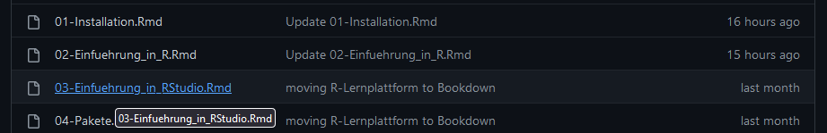
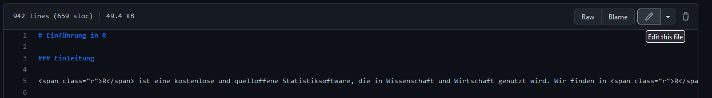
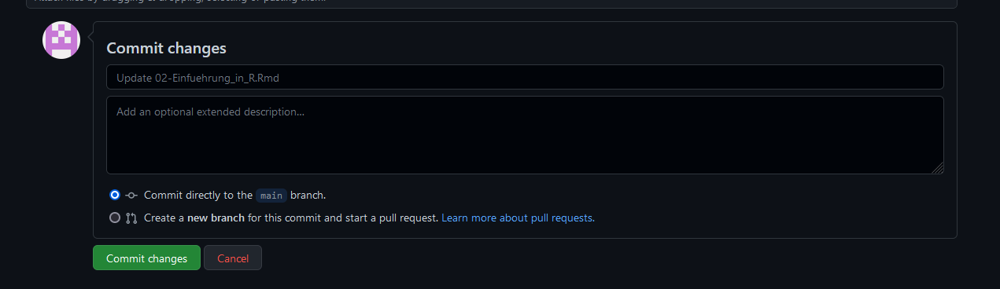
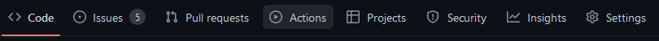
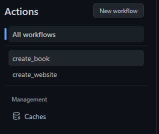
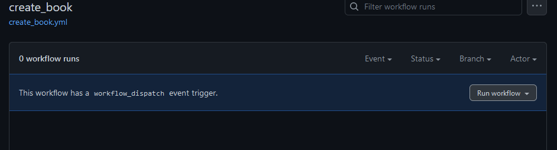
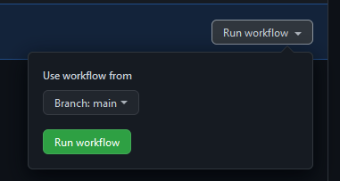
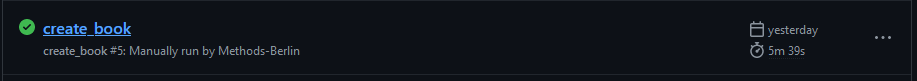
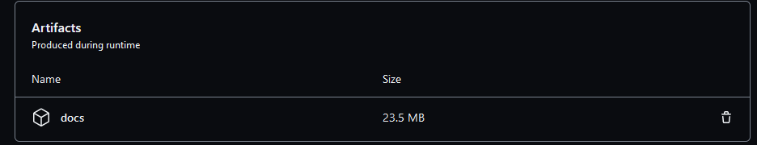

# Interne Dokumentation

Dieses Repository enthält alle Dateien, die für die Erstellung der RLernplattform notwendig sind.
Die Webseite ist als Bookdown Projekt angelegt und kann beliebig erweitert und überarbeitet werden.

## Was finde ich im Projekt?

Die wichtigsten Dokumente sind die RMarkdown-Dateien. Diese enden mit .Rmd und in ihnen sind die 
tatsächlichen Inhalte der Website gespeichert. Beispielsweise findest Du in "01-Installation.Rmd"
die Infos zur Installation von R und RStudio. Im Dokument "02-Einfuehrung_in_R.Rmd" befinden sich   
dann die Einführung in R. Die Dateinamen der Rmd Dateien beginnen immer mit einer Zahl (01, 02, ...).
Diese Zahl gibt an, in welcher Reihenfolge die Themen auf unserer Webseite auftauchen sollen. So kann 
man durch einfaches Umbenennen der Dateien auch die Reihenfolge der Themen verändern oder neue Themen einfügen.

Im Ordner "figures" befinden sich alle Bilder, die in der Webseite eingebunden sind. Beispielsweise befinden 
sich im Unterornder Daten-importieren/Bilder alle Bilder des Themas Daten importieren.

Im Ordner "data" befinden sich alle Datensätze, die zur Erstellung der Webseite notwendig sind. Diese werden 
in den Beispiel-Analysen verwendet (z.B. um das Einlesen von Datensätzen zu veanschaulichen).

Die restlichen Dateien sind notwendig für Bookdown. Den größten Teil hiervon können wir ignorieren. Für uns 
(manchmal) relevant sind hier eigentlich nur "style.css" und "DESCRIPTION". In "style.css" wird das Aussehen der 
Webseite definiert. Diese Datei ist aktuell einfach von der alten Webseite übernommen, was dazu führt, dass der
bisherige Stil beibehalten wird. In "DESCRIPTION" geben wir (unter anderem) an, welche R Pakete wir 
in den einzelnen .Rmd Dateien nutzen. Wenn wir beispielsweise lavaan nutzen wollen, müssen wir hier lavaan zu
den Paketen hinzufügen (siehe unten). Wenn wir das vergessen, kommt es zu Fehlern beim erstellen der Webseite!

## Themen bearbeiten

Themen können entweder direkt auf GitHub bearbeitet werden oder lokal auf dem eigenen Rechner. Wenn Du 
Themen auf Deinem Rechner bearbeiten möchtest, musst Du Dich mit git und GitHub auskennen. Im Folgenden 
werden wir uns auf die Bearbeitung direkt in GitHub konzentrieren. 

Angenommen Dir fällt ein Fehler in der Einführung in R auf. Um den Fehler zu beheben, öffne das Dokument 
"02-Einfuehrung_in_R.Rmd" in GitHub. 



Anschließend kannst Du die Datei bearbeiten, indem Du auf den Stift klickst:



Du kannst nun das Dokument verändern. Wenn Du alle Veränderungen vorgenommen hast, dann klicke auf commit (scrolle nach ganz unten).



Die Veränderungen sind nun gespeichert! **Wichtig**: Die Webseite wird nicht automatisch aktualisiert. 
Hier ist zur Zeit noch etwas Handarbeit erfordert. Das ist eine bewusste Entscheidung, um sicher zu stellen,
dass keine unfertigen Seiten aus Versehen online gehen.

### Code hinzufügen

Wenn man Code hinzufügen möchte, funktioniert das identisch wie in RMarkdown also, z.B. so:
```{r}
modell <- lm(noten ~ stunden)
summary(modell) # Anzeigen der Modellparameter
```

### Daten hinzufügen

Wenn Du einen Datensatz für Deine RMarkdown-Datei brauchst, der nicht in R oder
einem Paket enthalten ist, dann speichere diesen im Ordner "data". Anschließend
kannst Du ihn folgendermaßen in Deiner RMarkdown Datei einlesen: 
```{r,eval=FALSE}
mein_datensatz <- read.csv("data/mein_datensatz.csv")
```

### Bilder hinzufügen

Wenn Du Bilder für Deine RMarkdown-Datei brauchst, dann speichere diese 
im Ordner "figures". Anschließend kannst Du diese beispielsweise folgendermaßen
nutzen:

```

```

Eventuell musst du auch hierfür auch einen neuen Ordner erstellen (hier: den Ordner mein_thema). 
Wenn Du diesen online in GitHub erstellen willst, dann musst Du aktuell folgendermaßen vorgehen:

1. Gehe auf "create new file" oben rechts:


2. Schreibe den Pfad "mein_thema" in den Dateinamen:


3. Füge eine backslash "/" hinzu. Dann wird GitHub einen Ordner erstellen:


4. Weil GitHub uns nicht erlaubt, einfach nur den Ordner zu commiten, müssen wir 
zudem eine neue Datei erstellen. Ich nenne diese beispielsweise einfach temp.txt:


Anschließend können wir auf Commit klicken und haben nun einen neuen Ordner. Unsere Bilder
können wir über "Upload files" einfach von unserem PC hochladen.


### Links hinzufügen

Wenn Du intern auf ein anderes Thema referenzieren möchtest, kannst Du einen
Link einfügen. Dies geht mit:

```
[text, den die Leser:innen sehen][Überschrift des Themas, auf das verlinkt werden soll]
```

Beispielsweise führt folgender Link zur [R Einführung][Einführung in R].
Als Rohtext steht hier:

```
Beispielsweise führt folgender Link zur [R Einführung][Einführung in R].
```
Für Links zu Subseiten auf derselben Seite (z.B. sind wir bei 06_Fehlermeldungen und wollen auf das Unterkapitel Code Diagnostik innerhalb von 06_Fehlermeldungen verlinken) können wir die Links einfach so lassen.

Wenn wir auf Unterkapitel von anderen Seiten verlinken wollen (z.B. sind wir bei 01_Installation und wollen auf das Unterkapitel Code Diagnostik von 06_Fehlermeldungen verlinken), dann würden wir einfach den Namen des Unterkapitels angeben: [Code Diagnostik][Code Diagnostik].

### Paket hinzufügen

Wenn Dein neues Thema auch ein neues R-Paket benötigt, dann musst Du dieses
im Dokument `DESCRIPTION` zu `Imports:` hinzufügen (so wie beispielsweise dplyr).

> **Wichtig**: Wenn wir ein R Paket verwenden und dieses *nicht* zur DESCRIPTION hinzufügen,
dann kann die Webseite nicht erstellt werden! Die Webseite wird von GitHub erstellt und dafür
muss GitHub wissen, welche Pakete installiert werden müssen.

Wenn wir die Webseite auf unserem eigenen Rechner erstellen wollen, können wir wie
[hier][Alle Dependencies installieren] beschrieben vorgehen.

## Neues Thema erstellen

Es gibt mehrere Wege, ein neues Thema zu erstellen. Wir können, wie oben beschrieben,
eine neue Datei direkt in GitHub erstellen.


Dieser können wir nun beispielsweise den Namen "20-mein-neues-Thema.Rmd" geben und
sie direkt in GitHub bearbeiten. Wenn wir dies tun, können wir aber den R Code nicht 
ausführen; das geschieht erst, wenn die Webseite erstellt wird.

Ein einfacherer Web ist folgender:

1. Wir erstellen auf unserem Computer in RStudio eine neue RMarkdown Datei und nennen diese 
"20-mein-neues-Thema.Rmd".
2. Wir entfernen den gesamten Inhalt der Datei und fangen direkt mit einer Überschrift an 
(wichtig: es muss eine Überschrift mit nur einem Hashtag sein; siehe beispielsweise Zeile 1
in https://github.com/Methods-Berlin/RLernplattform/blob/main/04-Pakete.Rmd).
3. Jetzt können wir wie gewohnt unsere Inhalte in das RMarkdown file schreiben und den code
auch lokal laufen lassen.

Wenn wir fertig mit dem Erstellen der neuen Datei sind, können wir sie direkt auf GitHub
hochladen:


Unser neues Thema wurde nun hinzugefügt!

## Webseite erstellen

**Aktuell ist die Webseite noch nicht online!** Wir können aber eine offline-Version 
erstellen, die wir dann herunterlagen und auf unserem Computer anschauen können.
Hierfür werden GitHub Actions genutzt. 

> Hinweis: Wir haben nur eine begrenzte Rechenkapazität auf GitHub. Bitte erstelle
die Webseite nur dann neu, wenn Du alle Änderungen vorgenommen hast, die Du vornehmen
wolltest.

Das Vorgehen ist aktuell:

1. Klicke auf Actions



2. Klicke auf create_book



3. Klicke auf Run workflow



4. Wähle Run workflow



Das Bookdown Projekt wird nun in eine Webseite übersetzt. Diese ist allerdings nicht online!

Um die Webseite herunter zu laden, ist das Vorgehen:

1. Klicke auf Actions


2. Klicke auf den neuesten Durchgang der create_book Action



3. Scrolle ganz nach unten. Dort findest Du den Ordner _book unter Artefacts



Lade die Datei herunter und entpacke sie auf Deinem Computer. Im Ordner wirst Du unter 
anderem mehrere .html Dateien finden. Öffne eine beliebige dieser Dateien mit Deinem 
Browser, um die lokale Version der Webseite anzuzeigen.

### Alle Dependencies installieren

Solltest Du nicht alle Pakete installiert haben, die auf der Webseite genutzt werden,
kannst Du entweder die Datei `DESCRIPTION` öffnen und alle dort aufgeführten Pakete 
installieren oder Du öffnest die Datei `RLernplattform.Rproj` in RStudio und führst
folgenden Code aus:
```{r, eval = FALSE}
if(!require("devtools"))
  install.packages("devtools")
library("devtools")
devtools::install_deps()
```

